# Vespertine: Level Design & Layout Audit

**Status:** audit and design plan, 2026-10-04. **No level has been changed.** The gate in `STATUS.md` still holds:
no Hunt or mission *tuning* until the WASD Stealth Readability Test (R22) passes. Several findings below are
structural bugs (unintended routes past designed gates), not tuning. §15 says which can go ahead now.

**Reads with:** `GAMEPLAY_REDESIGN.md` (the target game), `LEVEL_DESIGN.md` (the current rules), `CAMPAIGN.md`
(mission briefs), `PROGRESSION.md` (Awakening per night).

**Evidence:** `Docs/level_audit/` holds a top-down **layout** and **analysis** image for every mission, plus the
raw numbers (`metrics.json`, `variants.json`, `special.json`, `feeding.json`). The tool that makes them is
`Tools/level_audit/` (see its README); re-run it after any map edit.

---

## 0. The verdict on one page

**The missions are better ideas than they are spaces.** Every night has a strong premise:
- the bells that are both objective and alarm network;
- the kidnap you must carry home on foot;
- the masque you can only enter by invitation;
- four river banks that must each be crossed;
- the hunt by a tracker who follows your blood;
- the escort that cannot climb;
- the opera kills on a ninety-second fuse.

The level *contracts* these premises set up are the best thing in the project. The *geometry* underneath them
was built for an earlier, earthbound version of the game. It has not caught up with the vampire the player
becomes by Act II.

**Six findings decide almost everything else.**

1. **From Awakening 4, the wall tops are a second map that bypasses the first.**
   - Wallcrawler has no height limit, and every 3 m wall top is walkable. Watchmen can't see more than 2.5 m
     above themselves outside their near band.
   - So in M04, M06, M09, M11, M12 (without searchlights), M13 and M14 the least-risk route to most objectives
     runs 50–80% on wall tops and crosses **0–1 watched cells**. The best ground-only route crosses 2–20.
   - Only **M07** (running water forces checkpoints) and **M05/M09** (carrying and escorting forbid climbing)
     still make the ground matter. (§3.1)
2. **The counter to the roofs doesn't work.** The Vigil's "looks up" removes the height exemption, but the far
   band still needs the target lit, and roofs are 0–15% lit. Every one of the **42 moon pools** in the campaign
   contributes **zero** gameplay light (`GameLight.FitUnityLight`: "a high moon: keep the authored look"). So a
   hunter sees a roof only within his 7 m near band. (§3.2)
3. **Interiors and undergrounds are open-topped pits, so ceilings are floors.** In **M14** at its expected
   Awakening (8–10), Ilse crawls the nave's south wall, walks across the solid rock above the undercroft and drops
   into Saule's laboratory, the vault and the river room. That bypasses all three designed ways down. The M06 house
   and the M09 study have the same flaw in smaller form. **This is a P0 structural bug.** (§3.3)
4. **Light is mostly islands, not geometry.** Only 4–21% of walkable ground is gameplay-lit. 86–100% of posted
   guards have unwatched darkness within 6 m. So "where is it dark?" is rarely the question, and drag, Smother
   and the gas mains are rarely load-bearing. (§3.4)
5. **Patrols are long beats, not loops.** 116 of 135 patrolling NPCs exceed the 40 s rule in `LEVEL_DESIGN.md` §1.4
   (up to 235 s). Late missions are 66–81% static posts. Few areas have anything to *create* an opening with:
   Rattle, routine stops and lamp checks aren't built, and placed interactables run 2–14 per map, most of them objectives rather than tools. (§3.5)
6. **The Hunt will expose interiors, not streets.** The street maps (M02, M03, M05, M07, M10, M13) already have
   the rings the Hunt needs. Prisons, wards, the undercroft and estate compounds are trees of dead-end rooms.
   The Hunt isn't built yet, so this is a prediction from geometry. (§3.6)

**Scores.**
- **Overall level design: 55/100** (commercial bar ~75).
- **Best current level:** M07 *The Toll Bridges*.
- **Weakest:** M14 *The Abbess Beneath*, because its descent collapses at the Awakening players will have. M09 is
  the runner-up.

**What I would do first:**
1. Give the engine **ceilings**: a non-walkable "rock / roofed" top and a cap on wall-crawl height.
2. Make **roofs a contested layer** with a skyline rule, so look-up hunters can see a figure on a roof against
   the sky.
3. Make **moonlight tell the truth**: either real gameplay light or no pool.

Then rebuild **M14's descent**, **M04's nave ring** and **M02's roof block**, and make **M05's gas mains** the
carry route's key. Full list in §12–§13.

---

## 1. How this audit was done (read first)

**Unity is not available in this environment, so nothing here was played by hand or in the editor.** Instead:

- **Every map was rebuilt offline from its mission file** (`Tools/level_audit/mapmodel.py`), mirroring the game's
  own rules:
  - `MapParser` for the format;
  - `TileDefs` for heights, floors and vision blockers;
  - `NavBuilder` for links: pipes and stairs, drops, wall-crawl at A4 with no height limit, and leaps across 1–2
    cell gaps at A3, never over water or void;
  - `Vampire.AreaMask` for Awakening gating and the rule that carrying forbids climbing;
  - `GameLight` and `LightSystem` for every light kind's radius, intensity and height, falloff, the max-of-sources
    rule, wall occlusion and unoccluded moonlight;
  - `DetectionMath.Classify` for near and far bands, the 1.4 m touch zone, the 2.5 m height rule and LooksUp;
  - `Archetypes` for each type's field of view and ranges;
  - threshold zones, which block all heights (`Zone.WorldBounds` is 20 m tall);
  - locked doors and gates, which start shut.
- **Patrols** are walked along the shortest human path between waypoints, with waits and look directions.
  **Searchlights** are swept along their waypoints as intermittent cover. **Dormant `cm_*` Dossier groups** were
  tested on and off.
- **The "safest route"** is a least-risk path for the vampire at the Awakening the campaign simulation says players
  have that night (`PROGRESSION.md`, Typical and Ghost):
  - risk = +40 per cell inside a static guard's seeing region (near band, or lit far band);
  - plus 30 × the fraction of time a patroller or searchlight sees the cell;
  - plus 2 for lit ground.
  - "Watched cells" counts cells with risk ≥ 5.
- **Hunt heat** classifies each ground cell:
  - its local topology: dead end, corridor, junction or open, from the branching of the walk ring 12 m out;
  - its space's exits: rooms are split at doorways and one-cell passages;
  - a climb within 10 m at that night's Awakening;
  - unwatched darkness within 6 m;
  - a penalty for standing in light.

**Limits.**
- Sub-cell props are ignored except as clutter flags.
- Line of sight is a 2D grid march with heights.
- Searchlights and carried lanterns are approximated.
- Boats aren't routed.
- The Hunt, grab-drag, Rattle, routines, Shove and push-doors are **not built**. Their sections are design
  predictions from geometry.

None of that changes the headline findings. They rest on rules read directly from the code (§3.1–§3.3 cite them).
**Verify the P0 in the editor before acting on it:** `Tools/scratch_backup/reach.sh` at Awakening ≥ 4 from the M14
nave to (20,26) (§15).

**What is built today**, per `TASK_LIST.md`:
- **Built:** WASD and camera changes; the readability layer (contextual cones, rims, disc, toe, captions);
  Shadow Dash with the Rise; Beckon from M02; the Arts after M01; local shouts; the Dazed fix; the Dossier from M03.
- **Not built:** the Hunt (Spotted wind-up, Hunt, Lost); grab-drag-feed, Warm and Overflow; the Reaction Window
  slow-mo; Shove; Rattle; routine stops; push-to-open doors; corner slip; camera occlusion; the Terror inversion;
  Preparations.
- **Still the old values:** drop-feed is A7 in code (the redesign wants A2), and skills still number 42.

---

## 2. The game the levels must now serve

The levels are judged against `GAMEPLAY_REDESIGN.md`, not against the click-to-move game they were built for:

- **Direct WASD.**
  - Sneak at 2.2 m/s (guards walk 1.6); walk 3.4 m/s with a 3.2 m noise ring; run 6.8 m/s with 8 m.
  - Push-to-climb, silent drops.
  - The camera sits at about 20 m, 52°, with no occlusion yet.
- **Shadow Dash.** A 6 m navmesh burst (3 cells) with 2 charges that refill only in darkness. The Rise lifts her up
  ≤ 4 m in the dark, so up a wall or gallery but not a 4.5 m house (K42).
- **Light.**
  - One threshold, 0.35.
  - Exposure radii: gas lamp 5.5 m, wall lamp 4.8, brazier 5.6, lantern 3.7, candle 2.8, chandelier 6.7,
    fire 7.0, sunstone 6.6 (burns).
  - The moon contributes nothing (§3.2).
- **Vision.**
  - A near *sector* (4–8 m by type) sees her in any light.
  - The far band (10–22 m) sees her only if she is lit.
  - The touch zone is 1.4 m all round.
  - Targets more than 2.5 m above the guard are invisible to the far band unless he `LooksUp` (hunter, sentry,
    inquisitor, tracker, Vane).
- **Feeding as the signature act.** Grab, drag into the dark, then sip or drain. Drop-feed is meant to be baseline.
- **The Hunt.** Local pursuit, a visible last-known position, pairs that split. Spaces need rings, vertical
  escapes and re-entry.
- **The Laws as level contract.** Running water, thresholds, holy light and sunstone, wards. Every gate needs a
  baseline answer plus build-specific answers.
- **The arc.** Act I avoid, Act II isolate and feed, Act III manipulate a block, Act IV break posts while the Vigil
  holds.

---

## 3. Campaign-wide findings (systemic)

These problems recur on many maps, so each is a design-system problem, not one level's bug.

### 3.1 The wall-top layer is a second map, and from Awakening 4 it wins

**The rules, from code:**
- `NavBuilder` adds a wall-crawl (`ClimbAny`) link between any two adjacent walk tops that differ by ≥ 1.5 m, with
  **no upper limit**, so 3 m, 6 m and 9 m faces are all climbable.
- `Vampire.AreaMask` enables it at Awakening 4.
- Every `#` wall, `u` gallery, `h`/`H` building and `T` tower has a walkable top. Interiors have no ceilings.
- `Classify` hides anything more than 2.5 m above a guard from his far band unless he looks up. Only the near
  sector (4–8 m) ignores height.

**The result**, at each night's typical Awakening, with every dormant Dossier body switched on:

| Mission | Awakening | Target | Safest route on walls/roofs | Watched cells (safest route) | Watched cells (best ground-only) | Roof-preferred: ground cells / watched |
|---|---:|---|---:|---:|---:|---:|
| M01 | 1 | wheel | 0% | 0 | 0 | 26 / 0 |
| M02 | 2 | Tobias's window | 39% | 0 | needs a climb | 25 / 0 |
| M03 | 3 | manifest | 63% | 2 | needs a climb | 48 / 2 |
| M04 | 4 | Bell A | 66% | 0 | 7 | 6 / 0 |
| M04 | 4 | registry | 55% | 0 | 4 | 6 / 0 |
| M05 | 5 | Penrose | 43% | 2 | 2 | 10 / 1 |
| M06 | 5 | leave (after the study) | 81% | 0 | 5 | 7 / 0 |
| M07 | 6 | fen road | 25% | **14** | needs a crossing | 66 / **14** |
| M08 | 7 | Hollin | 29% | 2 | 6 | 41 / 3 |
| M09 | 8 | Subject 12's cell | 29% | 0 | 11 | 6 / 0 |
| M10 | 8 | consignment 2 | 10% | 4 | 6 | 16 / 7 |
| M11 | 8 | Lowell (royal box) | 49% | 3 | needs a climb | 6 / 3 |
| M12 | 9 | Dossier (archive) | 58% | **14** (searchlights) | needs a crossing | 9 / 14 |
| M13 | 9 | cathedral west doors | 52% | 0 | 20 | 15 / 0 |
| M14 | 10 | Saule | 59% | 6 | locked | 8 / 4 |
| M14 | 10 | the Abbess | 57% | 0 | locked | 11 / 0 |

Full table: `level_audit/variants.json`.

**Reading the table.**
- Before A4 (M01–M03 for most players, to M05 for a Ghost), the vertical layer is reached by authored climb
  points, and the ground still matters. Those are the healthiest nights.
- From M04 on, **the roofs are a second map with no inhabitants.** The cautious, ghost and optimiser players all
  converge on one plan: climb the nearest wall, walk the tops, drop beside the objective. In M04 that skips the
  bell-alarm network entirely (6 ground cells to Bell A, zero watched).
- **Only three structures resist:**
  - **running water** (M07; M12's moat, where searchlights carry the load);
  - **carrying** (M05: climbing is disabled while she carries Penrose);
  - **escorting** (M09: fledglings can't climb).

  Each forces the ground. They are the campaign's best design moves, and they should be generalised (§11, rule 7).
- **This is the rooftop dominance the brief warned about.** The cause is not that roofs exist; it is that:
  - every wall top is a pavement;
  - the counter can't see roofs (§3.2);
  - interior walls are walkable (§3.3);
  - map borders are raised (§3.7).

### 3.2 The roof counter is neutered by dark roofs and a moon that doesn't count

**What exists to contest the roofs:**
- the Vigil's `LooksUp` (hunters, sentries, inquisitors, Hollin, Vane);
- flares, thrown into *suspicious* darkness;
- the Dossier's `cm_rooftop` wall sentries (M07–M13 only).

**Why none of it works:**
- `LooksUp` only cancels the 2.5 m height exemption. **The far band still needs the target lit.** Lit share of
  raised walk tops per map: 0% (M14) to 15% (M11), with a median of about 6%.
- **Moonlight is gameplay-zero by construction.**
  - A `moon` light sits 12 m up with a 3–7 m radius. `LightAt` measures 3D distance to the chest, so no ground
    or 3–6 m roof cell is ever inside the radius.
  - `GameLight.FitUnityLight` notices this ("never exposes her on the ground (a high moon): keep the authored
    look") and keeps the blue pool anyway.
  - The redesign's "moonlit roofs (0.3)" (§31.5) doesn't exist, and 0.3 would be below threshold even if it did.
- **So a look-up hunter sees a roof-walker only inside his near sector, 7 m.** He is a short-range sentry with a
  tilted neck, not a roof counter.
- Static look-up coverage of the raised layer (`roof_cells_watched_by_lookup`): M07 65 of 958 cells, M13 64 of
  2,017, M14 89 of 1,391. Only M11 (234 of 874) and M12 (250 of 867) watch a meaningful share, both because their
  galleries and walls are lit.

**The 42 moon pools also break the readability standard backwards.**
- They render as cool lit pools on the floor and change nothing.
- `GAMEPLAY_REDESIGN` SR.2 wants "if it looks lit, it is lit". Moon pools teach the opposite: some light is fake.
- M08 (the darkest map, 4.4% lit ground) has five, M06 five, M13 five, M02 four. In the M01 tutorial ward, the
  three pools are the only "light" in the dark route the hints teach.

**Fix the counter before rebuilding roofs** (§13, #3, #4):
- a **skyline rule**: a look-up guard's far band sees a target on a raised top silhouetted against open sky (no
  higher tile behind her along his line), at a reduced rate, whatever the light;
- moonlight that counts on roofs and open ground, or no moon pools at all;
- lit **chimney-pots and parapets** at roof junctions, so roofs get light pools and a lamp to Smother.

### 3.3 Ceilings are floors: open-topped interiors and undergrounds

**The map format has one walkable surface per cell, and every wall top is walkable.** So:

- **M14 (P0).** The undercroft and vault are cut out of a solid `H`/`T` mass, and the mass's top is walkable.
  - At Awakening ≥ 4, from the nave floor at (11,21) she wall-crawls the 9 m south wall, drops onto the rock at
    (11,23), leaps the sexton's stairwell and drops into the undercroft at (20,26). That is 78 m from the start
    to Saule.
  - The same surface reaches the vault (a 118 m route) and the river door.
  - **The bricks deed, the sexton's stair (`d_sexton`), Ashby's door, the vault gate `g_vault` and the
    Faithful-flag branch are all optional.**
  - PROGRESS (2026-10-02) shows the team caught one instance, a stair against the `T` wall, and moved it. The
    general case escaped because play-testing used a low-Awakening dev campaign. `reach.sh` uses Ilse's current
    area mask.
- **M06.** After the invitation, the house's interior walls are a catwalk over the masque.
  - All three listen points can be heard from the wall tops: radius 6–9 m, and 4.5 m vertical is allowed.
  - The mask rules ("feet on a floor"), restricted rooms and the locked study (crawl over its wall) stop
    mattering at Awakening 5.
  - Only the near sector of a guest under the wall can catch her.
- **M09, M12, M13.** Locked rooms open to the sky are reachable over their walls:
  - M09's study at A6+;
  - M12's prison cells and postern at A7+;
  - M13's lock-up, the Hallorans' house and the sexton's house at A8+.

  The doors still matter for escorted prisoners, who can't climb, but not for Ilse.
- **Every interior's wall network** (M01, M04's nave, M05's hall, M09's wards, M11's house) is a raised grid over
  the rooms. That makes interiors *the* easiest places to cross, the reverse of what interior stealth needs.

**This is a tile-semantics problem, not 14 level problems.** The engine needs:
1. a raised tile with **no walkable top that can't be crawled**: rock, earth, a roofed interior wall;
2. a **roofed zone** flag that removes wall-top walking inside a building's footprint, while keeping authored
   galleries (`u`) and stairs;
3. a **cap on wall-crawl height** or per-material crawlability: rough brick and stone yes, dressed ashlar,
   plaster, rock and 9 m towers no, unless there's a climb point.

Then authored verticality becomes a choice, not a property of every wall. See §13 #1.

### 3.4 Light is islands, not geometry

| | M01 | M02 | M03 | M04 | M05 | M06 | M07 | M08 | M09 | M10 | M11 | M12 | M13 | M14 |
|---|---|---|---|---|---|---|---|---|---|---|---|---|---|---|
| Ground lit ≥ 0.35 | 14% | 15% | 21% | 20% | 20% | 12% | 19% | 4% | 13% | 20% | 10% | 12% | 15% | 11% |
| Posts standing in light | 50% | 50% | 44% | 31% | 33% | 38% | 48% | 75% | 8% | 17% | 24% | 27% | 35% | 19% |
| Posts with unwatched dark 2–6 m away | 100% | 100% | 89% | 100% | 100% | 100% | 86% | 100% | 100% | 100% | 98% | 97% | 92% | 95% |
| Moon pools (render only) | 3 | 4 | 1 | 2 | 1 | 5 | 3 | 5 | 2 | 3 | 3 | 3 | 5 | 2 |

**What the table means:**
- `LEVEL_DESIGN.md` rule 2 says "Light pools are the walls of the level". In practice they are **islands in a dark
  sea.**
- **Most posted guards already stand in the dark.** That leaves the near band as the only rule that matters, so
  feeding is usually done in place, without a drag.
- Smother and the gas mains are seldom load-bearing. M05's carry, the mission *about* gas mains, has a 74 m dark
  route from Penrose's study to the boat **with every lamp lit**: through the hall's east door and the side door,
  down the unlit lane between guildhall and depot, across Guild Street (`special.json`). Shutting any main changes
  it by two cells.
- **Act I was meant to be lamp-heavy** (redesign P4 mitigation, "Act I maps are lamp-heavy") so that Dash and
  darkness would be scarce. M01 is 14% lit.

**What light should do instead:**
- **Light the spaces the player must cross:** street crossings, alley mouths, bridge feet, yard gates, roof
  junctions.
- **Keep deliberate dark channels**, at least 1.5 m wide, that cost something: noise (gravel, water), a longer way
  round, a patrol beat or a near-band squeeze.
- Target **30–45% lit ground in hubs**, and posts **lit with a 2–5 m dark pocket beside them**: the
  grab-and-drag setup.
- The darkness should be the reward the player made: by a valve, by Smother, by a lamplighter killed.

### 3.5 Patrols, posts and opportunity

| | M01 | M02 | M03 | M04 | M05 | M06 | M07 | M08 | M09 | M10 | M11 | M12 | M13 | M14 |
|---|---|---|---|---|---|---|---|---|---|---|---|---|---|---|
| Patrollers over 40 s / all patrollers | 3/4 | 6/7 | 4/7 | 9/13 | 10/10 | 20/20 | 7/11 | 3/3 | 7/7 | 11/11 | 12/14 | 9/12 | 7/8 | 8/8 |
| Longest cycle (s) | 63 | 122 | 127 | 156 | 163 | 236 | 121 | 117 | 155 | 106 | 144 | 145 | 181 | 190 |
| Static share of hostiles | 20% | 46% | 50% | 41% | 23% | 49% | 66% | 80% | 63% | 54% | 81% | 68% | 75% | 72% |
| Placed interactables (valve, bell, lever, gate, generator, use, trap, listen, boat, window) | 2 | 2 | 3 | 3 | 3 | 4 | 7 | 3 | 4 | 8 | 7 | 14 | 5 | 9 |

Cycle times are computed: walking time at 1.6 m/s along each waypoint path, plus waits. Ping-pong routes count both ways.

- **The 40 s rule is broken almost everywhere.**
  - Long ping-pongs down a whole street (M02's back court, M04's quay, M07's Row) are moving walls with a 60–120 s
    window. That is the "waiting simulator" the rule exists to prevent.
  - M06's guest loops are fine as crowd colour, but they count as cones.
- **Late missions turn into posts:** 66–81% static from M07. Posts make cone walls and a single timing solution.
  Patrols make openings.
- **Nothing to create an opening with.**
  - The redesign's Rattle objects (2–4 per area), routine stops (privy, smoke, lamp check) and
    lamplighter-as-lure are not built and not placed.
  - The few interactables are mostly objectives (bells, levers, `use` deeds), not tools.
  - M02 and M05's gas valves are the exceptions, and they work exactly as §30's "multi-purpose element" should: a
    valve darkens a block, calls a lamplighter, warns Pell.
- **Where routines exist, they're the best moments in the campaign:**
  - Ashcombe's 45 s terrace dwell (M06);
  - Vane kneeling 35 s under the sanctuary lamp (M12);
  - Thorne walking to the Great Bell after the ropes are cut (M04);
  - Saule's walk to the purge gauge (M14);
  - Penrose storming out to the guild main (M05).

  There should be one per major area.

### 3.6 Hunt support: streets work, interiors don't

These are predictions: the Hunt isn't built. From the geometry:

| | M01 | M02 | M03 | M04 | M05 | M06 | M07 | M08 | M09 | M10 | M11 | M12 | M13 | M14 |
|---|---|---|---|---|---|---|---|---|---|---|---|---|---|---|
| Spaces (≥ 6 cells) | 8 | 5 | 5 | 11 | 7 | 13 | 14 | 7 | 18 | 6 | 7 | 25 | 11 | 7 |
| Dead-end spaces (≤ 1 exit) | 2 | 2 | 2 | 5 | 1 | 3 | 5 | 4 | **8** | 0 | 1 | **12** | 7 | 4 |
| Ground within 10 m of a climb at A1 | 4% | 14% | 19% | 11% | 11% | 1% | 13% | 17% | 5% | 18% | 14% | 13% | 9% | 7% |
| Same, at that night's Awakening | 4% | 14% | 19% | 87% | 89% | 54% | 71% | 65% | 98% | 94% | 92% | 98% | 97% | 84% |

**Readings:**
- **Vertical escape is everywhere once Wallcrawler arrives**, and almost nowhere before it. Act I has 4–19% of ground
  within 10 m of a climb, against the redesign's "climb point within 10 m of every hub" (§21).
  - **M01's only climb point is the boiler-room pipe.** A tutorial chase there is run-and-hide only.
  - In Act II+ the opposite holds: every wall is an exit, and humans can't follow without stairs.
  - That makes Hunts *too easy to break* by climbing, unless the skyline rule (§3.2) makes the roof a place where
    she can be seen and flared.
- **Excellent Hunt spaces** have a ring of 30–60 m with dark stretches, 3+ exits and a climb:
  - M02's quay / back court / side yard / Lantern Street loop;
  - M03's fish market with its stalls and two taverns;
  - M05's south boulevard;
  - M07's banks;
  - M10's yards;
  - M13's Wick and market blocks.
- **Broken Hunt spaces** are a dead-end room behind one door, lit or with no climb, where a shout means a cornering:
  - M09's Ward C cells (a sunstone corridor);
  - M12's prison cells and question room;
  - M14's two 1-cell stair shafts and the purge chamber;
  - M04's lock-up;
  - M01's records office (it is also the reinforcement spawn);
  - M02's coach yard (walled, a posted gate).

  Some are *deliberate* dangerous spaces (prisons should feel like traps). They need a visible second way out:
  a vent for Mist, a window, a drop from the wall, so the Hunt is hard, not hopeless.

### 3.7 The perimeter highway

- Thirteen of the fourteen maps put raised tiles on their border (an `H` building edge or a `#` estate wall), on
  13–98% of the edge; only M08's fen has none.
- Once climbable, the border becomes the unwatched outer lane.
- The optimiser uses it in M06 (63% of the safest route runs on the estate wall), M11 (24%), M03 (18%) and
  M10 (14%).
- Map edges should be **unclimbable dressing**: void, rock or a tall facade that can't be crawled. Then the
  playable roof network is what the designer drew.

### 3.8 One floor-plan grammar

Interiors in M01, M04, M05, M06, M09, M11, M12 and M14 share one grammar:
- rectangles of floor bounded by 1-cell walls;
- 1-cell doorways on room midlines;
- corridors 2–3 cells wide;
- rarely a second level, except `u` galleries in M03, M09's observation deck, M11's tiers and M12's archive.

**The consequences:**
- Rooms read as *stealth arenas* rather than places: the ward, the hall, the bunkhouse, the archive and the cell
  block all have the same shape.
- **Interior map memory is weak.**
- **Doors are a WASD tax until push-to-open lands.** Each crossing is a stop and an E press:
  - door entities per map: M12 30, M09 18, M04 13, M13 13, M10 11, M01 9, M14 9, M05 8, M11 7, M02 6, M03 5,
    M06 4;
  - M06 also has 21 open doorways.

### 3.9 Exits: three walk-backs and some excellent escapes

**Good:**
- **M01:** the valve scream plus a reinforcement rush at the gate, a micro-escape.
- **M05:** the carry *is* the exit.
- **M07:** a traverse, where the destination is the goal.
- **M10:** a 60 s fuse run across the works, with the holder going up behind her.
- **M12:** the burn choice leads to a lockdown escape.
- **M14:** a destroy countdown to the river door.

**Walk-backs through a solved map:**
- **M03:** "back down the old pier, where you came in". After the theft nothing changes; the bridge, skiff and
  roofs are as they were.
- **M04:** the registry is in the north centre; the escape is at the far south-east Weir steps.
- **M09:** Clement's route is 180–192 m on foot, past rooms already cleared.

The redesign's consequences-by-type (a theft in view locks that quarter's exits; pursuers follow indoors) would
help. A **post-objective world change** is cheaper and better: Quill raises the swing bridge; Thorne's discovery
turns out the Watch-house.

### 3.10 The Vampire Laws in the geometry

| Law | Where it shapes topology | Verdict |
|---|---|---|
| **Running water** | M03 (Ost: bridge, skiffs, arch roofs); M07 (Leat, Ost, Fen Cut: 2–3 crossings each, different costs); M08 (peat drain, Marrow Cut, traps that use the water); M12 (the moat: weir, skiff, causeway); M13 (Mercy canal, 3 bridges) | **Excellent.** The one law that changes route structure, and the reason M07 is the best map. M01, M02, M05 and M10 use water only as a body dump or a boundary |
| **Threshold** | M02 (knock, then be invited: the climax); M06 (invitation + mask, or a thrall at the kitchen door) | **Good but rare.** Only two homes in 14 missions. Redesign §21's "Faithful homes as escape hatches" isn't authored anywhere. M13's barred Halloran house is a *locked* door, not a threshold: a missed beat |
| **Holy light / priests** | M04 (votives at Bell A, altar, wayside); M07 (chapel of Saint Ide); M11 (Lowell's aura in the royal box); M12 (sanctuary lamp, Vane) | **Decorative.** Holy pools sit at door frames and altars. None makes a moving zone of denial (a priest's procession, a censer round) |
| **Sunstone** (burning, smashable, generator) | M09 (escort corridor, generator + engineer); M12 (keep doors, archive); M14 (Saule's ring + generator) | **Strong in M09**: the escort needs the generator, and the min-burn route equals the shortest route for all three fledglings |
| **Garlic / censer, salt, silver, wards** | Dossier systemic effects; censer-bearers only as dormant `cm_censer` posts | **Absent from geometry.** No salt line, warded door or garlic yard is authored as a gate with answers |

### 3.11 Mission identity: the strongest asset

Every mission has a one-line gameplay identity no other mission shares:
- **M01:** the screaming valve.
- **M02:** knock and be asked in.
- **M03:** the river and the harbourmaster upstairs.
- **M04:** the bells that are both objective and alarm.
- **M05:** carry her home.
- **M06:** the masque.
- **M07:** four banks.
- **M08:** the tracker.
- **M09:** the escort that can't climb.
- **M10:** the fuse.
- **M11:** ninety seconds.
- **M12:** the fortress that read your Dossier.
- **M13:** squads that break.
- **M14:** the dawn that creeps.

**No two collide.** That is rarer than the scores in §8 suggest, and it is why rebuilding *spaces* is worth it:
the premises are worth the work.

---

## 4. Mission by mission

Each mission has two images in `level_audit/`:
- **`*_layout.png`** shows tiles, gameplay-lit cells (amber), moon pools (blue rings), posts with their near sector
  (squares, red wedge), patrollers and routes (dots and lines), doors (red = locked, violet = threshold), lights,
  interactables, start (green) and objectives (pink).
- **`*_analysis.png`** shows the Hunt heat (green excellent → red broken), permanent watch (red hatch), patrol
  watch (magenta dots), roof cells seen by look-up guards (white boxes), the safest ground route (cyan), the
  safest route at that night's Awakening (white) and minimum cuts (yellow).

The diagrams are structure, not scale.

**What the per-mission tests cover:**
- The **player-path test** traces six players: Cautious, Predator, Ghost, Manipulator, Optimiser, Chaotic.
- The **readability test** asks whether the Q1–Q5 questions of §44.1 can be answered from the space at walking
  speed.
- The **fun test** names where the clever, risky and improvised moments are, and where nothing happens.

### M01 — The Drowned Ward (Act I, Awakening 1)

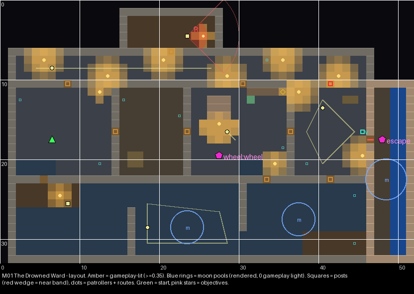
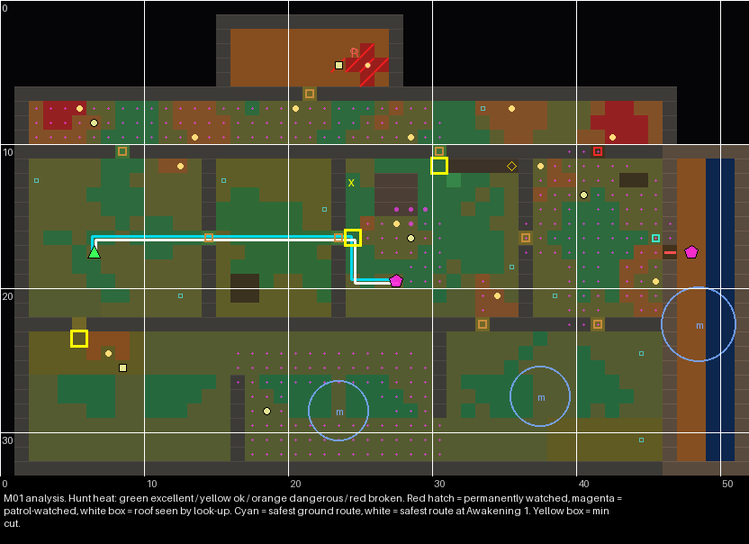

```
            [records office: clerk + record; reinforcement spawn]
                         |
START morgue ── records corridor (6 wall lamps, ping-pong 63 s) ────── [antechamber N door: LOCKED]
   |                 |                          |
   |── linen store ──┴── BOILER ROOM (stoker at the fire, WHEEL behind him, pipe ↑ catwalk → wall tops)
   |                                            |
   └── FLOODED WARD: dozing orderly ── bay 2 (lantern loop) ── empty east bays ── antechamber ── GATE (valve) ── culvert EXIT
```

**What works.**
- **A "ladder" of rooms between two lanes**: morgue, linen store, boiler room and antechamber, each with 3–4 doors.
  It is the right tutorial topology: real rings, short distances, three ways to the boiler room.
- **The objective chain**: a wheel behind a stoker who faces the fire for 9 s, a valve that *screams*, two
  orderlies running down, bars that rise slowly. It ends the tutorial with a readable micro-escape, the Hunt
  in miniature.
- **The staged first feed** (asleep, by a candle, at the ward entrance).

**Problems.**
- **The flooded ward's east half is a 30 m empty walk.** One loop guards bay 2, then nothing until the antechamber,
  in shallow water whose splash punishes the run the player wants.
- **Three moon pools are the only "light" in the dark lane, and they lie** (§3.2). They are the first lesson about
  light, and it's the wrong one.
- **One climb point** (the boiler pipe). It leads onto the whole wall-top network at Awakening 1, a silent drop
  into any room: a lot of power with no teaching.
- **The records corridor** is 6 m × 88 m of alternating wall lamps with a 63 s ping-pong: a pure timing corridor.

**Player paths.**
- Cautious, Ghost and Optimiser converge on the linen store → boiler → antechamber's east door.
- The Predator takes the ward: dozer, bay patroller, stoker.
- No manipulation exists yet.
- The Chaotic player in the corridor gets a shout heard by nobody past 15 m: Act I's free failure.
- **Two real approaches plus the corridor, which is good for minute one.**

**Hunt.** The rooms ring well. The antechamber has two entrances at the climax. The records office is the dead end
the reinforcements come from.

**Readability.** Fine indoors, except the moon pools and a wall-lamp corridor whose pools and gaps are 2–3 cells:
precise, but a timing read rather than a route read.

**Fun.** Peak: the stoker steal and the scream. Trough: the east bays.

| Category | Score /10 |
|---|---:|
| Layout | 7 |
| Movement | 7 |
| Readability | 6 |
| Light | 6 |
| Patrols | 5 |
| Routes | 7 |
| Verticality | 4 |
| Hunt suitability | 6 |
| Vampire mechanics | 5 |
| Replayability | 5 |

- **Strongest area:** the boiler room and the antechamber climax.
- **Weakest area:** the east flooded bays.
- **Biggest layout problem:** a long empty dark lane whose only "lights" are fake.
- **Biggest opportunity:**
  - make the ward the *body-verb classroom*: a ledge over bay 3 for the first drop (if drop-feed moves to A2), a lit
    bed-bay with a dark alcove 3 m away for the first drag, and a second, later loop in the east bays;
  - turn the moon pools into real skylight through the broken ward roof.
- **Would I rebuild part of it?** **Yes: the east half of the flooded ward** (bays 3–4). Small.

### M02 — Lantern Street (Act I, Awakening 2)

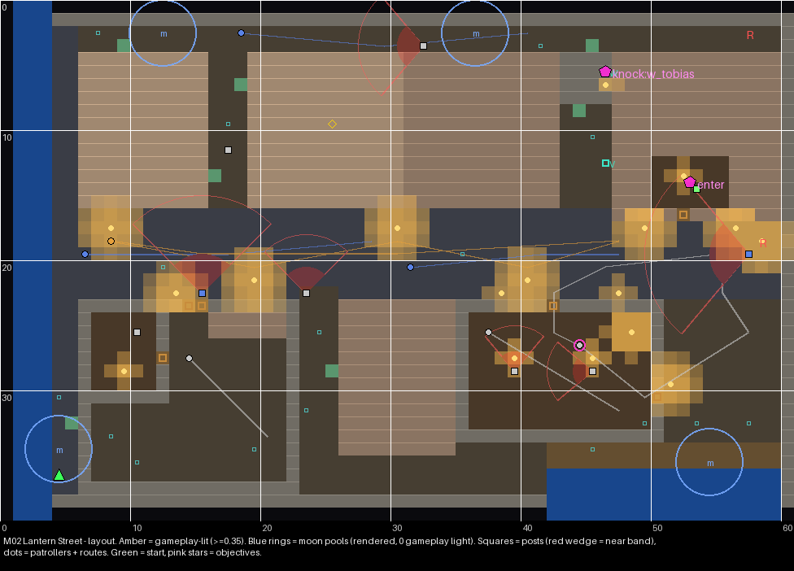
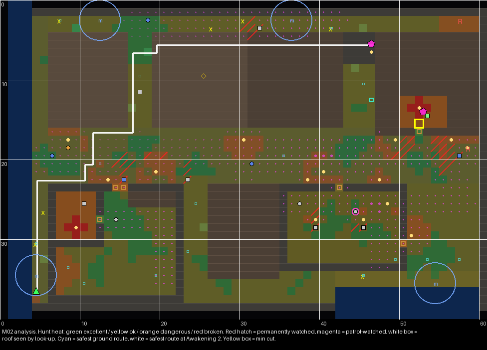

```
quay ─ back court (4 m strip, ping-pong 122 s, 2 fake moon pools) ─────────── side yard (pipe, GAS VALVE) ─ lean-to ─ WINDOW
 |        | pipes                                                                |
 |   ROOF BLOCK (6 m → 4.5 m, dark, nobody up there; slate secret) ══════════════╝
 |        | alleys
 └─ LANTERN STREET (14 m wide, 4 gas lamps on alternating sides, 2 watchmen, lamplighter, beggar) ─ Pell's brazier ─ FRONT DOOR (home)
          |                  |                    |
    coach yard          Tanner's Row         The Drowned Man (2 doors, Wick) ─ tavern yard ─ Weir dock
    (posted gate)
```

**What works.**
- **Three parallel E–W bands** (back court, roofs, street) joined by alleys and the quay: a clean "choose your lane"
  Act I structure.
- **Lantern Street's lamps alternate sides**, leaving readable dark gaps: the far-band lesson in one glance.
- **The threshold climax.** The knock reveals "enter", then the walk to the front door under Pell's brazier.
  The **gas valve** in the side yard darkens the lodge lamps but makes Pell call the lamplighter. A multi-purpose
  element exactly as the redesign wants.
- **Wick, the notable**, loops tavern → yard → street. A moving, high-value feed that passes in and out of light.

**Problems.**
- **The roof block makes the primary trivial.** A pipe from the alley reaches 937 cells of dark, unwatched roof.
  The window is 25 ground cells and zero watched cells away. The street, which the mission exists to teach, is
  optional until the final front-door walk. The script hint even says "Too bright. The rooftops".
- **The roof is a corridor of nothing.** No gap, no light, no person, no decision.
- **The back court and the roofs are near-duplicate parallel routes** 4 m apart: fake diversity. The court is
  slower and watched.
- **The whole south half** (coach yard, Tanner's Row, tavern, dock) is optional: about 45% of the map serves two
  optionals.

**Player paths.**
- Cautious, Ghost and Optimiser: quay → alley pipe → roofs → lean-to.
- The Predator hunts Wick and the coach-yard post.
- The Manipulator (Beckon arrives mid-mission) uses it on w4 at the yard gate.
- **The three primary routes collapse into one.**

**Hunt.** Excellent: the quay / back court / side yard / street ring, plus pipes, alleys and the tavern's two doors.
The coach yard is a dead end with a posted gate.

**Fun.** Peaks: the valve and Pell; Wick's loop. Trough: the empty roof walk.

| Category | Score /10 |
|---|---:|
| Layout | 7 |
| Movement | 8 |
| Readability | 6 |
| Light | 7 |
| Patrols | 5 |
| Routes | 5 |
| Verticality | 6 |
| Hunt suitability | 8 |
| Vampire mechanics | 7 |
| Replayability | 5 |

- **Strongest area:** the east end: valve, Pell and the threshold.
- **Weakest area:** the roof block.
- **Biggest layout problem:** an uncontested roof highway straight to the objective.
- **Biggest opportunity:** split the roof into three blocks separated by **lit alley mouths** (a lamp in each,
  4–6 m wide). Each crossing becomes a Dash-in-light choice (blur, detection +0.3, no recharge) or a drop to the
  street. Put the slate secret on a roof that can only be reached across one of them. **The roof stays faster but
  stops being free.**
- **Would I rebuild part of it?** **Yes: the roof block**, to make three roofs with lit gaps. Medium.

### M03 — The Fishmarket Hunger (Act I, Awakening 2–3)

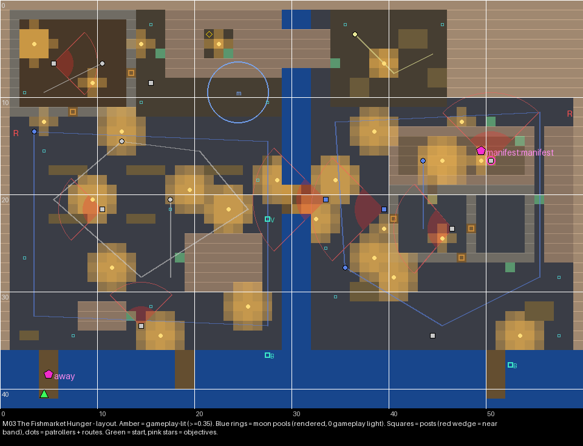
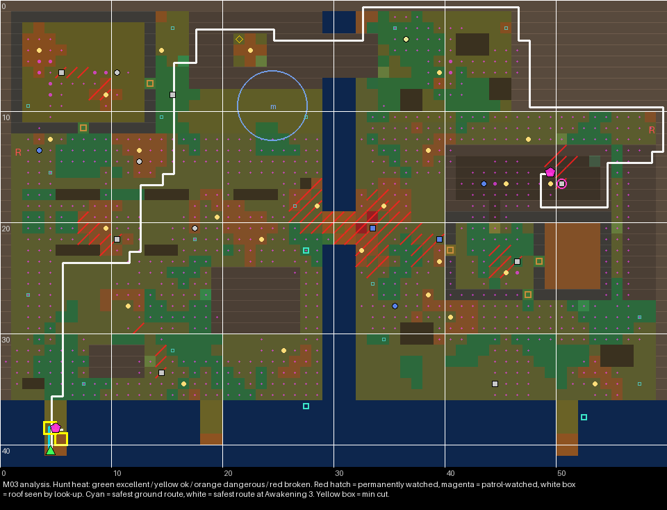

```
 The Herring ── back alley ── net-shed roofs (shrine pocket) ═ CUSTOMS ARCH (roof over the Ost) ═ bonded yard (orderly)
      |               | pipes                                                             |
 FISH MARKET (52×32 m: braziers, stalls, big Watch loop) ── SWING BRIDGE (lit, post, valve) ── Customs plaza ── HARBOUR OFFICE
      |                                                                                       (2 storeys: stairs, lane pipe, quay pipe;
 START old pier ── west quay (skiff) ~~~~~~~~~~ harbour mouth ~~~~~~~~~~ east quay (skiff)      manifest upstairs at Quill's elbow)
```

**What works.**
- **Running water as topology:** three crossings at three costs.
  - The lit, posted bridge has a gas cock that darkens it.
  - The skiffs are slow and exposed on the quays.
  - The roofs and Customs Arch are a vertical route.
- **The objective sits where systems meet.** It is upstairs in a lit room. **Quill sits with the manifest at the
  edge of his cone, 2.8 m away**: a feed, a Beckon or a precise steal. There are three ways up (stairs, lane pipe,
  quay pipe), plus w5's patrol up and down the stairs.
- **The fish market** is a varied open space (cover stalls, braziers, beggars and sailors for the blood-type
  optional). It is excellent for feeding choices.

**Problems.**
- **The exit is a walk-back** to the start pier through an unchanged map (§3.9).
- **The `H` perimeter is a highway.** The A3 optimiser runs net sheds → arch → north border → east border → office
  roof (18% of the safest route is on the map edge).
- **The fish market patrol is a 127 s rectangle** around the whole market.

**Player paths.**
- Ghost and Optimiser: arch roofs.
- Cautious: valve plus bridge, or a skiff.
- Predator: the market (three blood types), then the bridge post.
- Manipulator: Beckon across the water (the mission teaches it).
- **The routes diverge genuinely: the best Act I map for build expression.**

**Hunt.** The market and quays are excellent. The office is a two-storey trap with three exits: good.

**Fun.** Peak: lifting the manifest beside Quill. Trough: the return walk.

| Category | Score /10 |
|---|---:|
| Layout | 7 |
| Movement | 7 |
| Readability | 6 |
| Light | 7 |
| Patrols | 5 |
| Routes | 8 |
| Verticality | 7 |
| Hunt suitability | 8 |
| Vampire mechanics | 8 |
| Replayability | 7 |

- **Strongest area:** the Harbourmaster's office.
- **Weakest area:** the return trip.
- **Biggest layout problem:** a walk-back exit and the border highway.
- **Biggest opportunity:** **change the world when the manifest is taken.** Quill's bell swings the bridge open,
  so it can't be crossed. The exit moves to the *Ardent*'s boat on the east quay, or to the start through the
  market with the Watch alerted. The return becomes a new problem.
- **Would I rebuild part of it?** **No.** Tune the exit; make the border unclimbable.

### M04 — The Bells of Saint Corvin (Act I finale, Awakening 3–4)

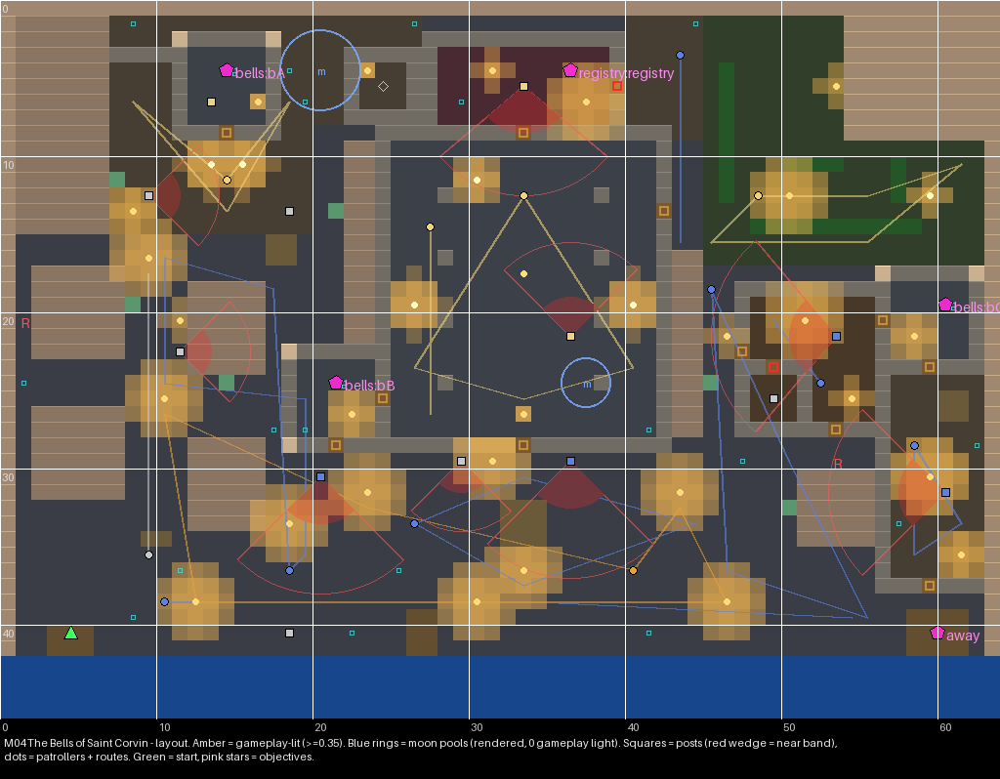
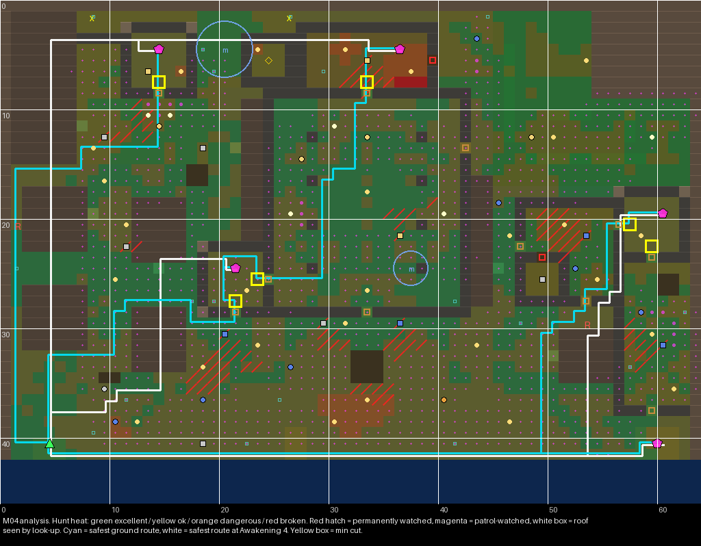

```
 almshouse yard (BELL A tower, votives, priest) ─ north alley (anchoress) ─ ARCHIVE (registry; Thorne) ─ Bishop's Close
      |                    ║════ aisle roof + continuous wall tops ring the nave ════║                     |
 Pilgrims' Lane ───────── NAVE (34×38 m: altar, votives, priest loop, acolytes) ─ east door ─ Watch-house (BELL C tower, Pell, yard)
      |                          |                                                                   |
 Great Bell tower (BELL B, post) ─ Cathedral Square (3 lamps, 2 posts, loop, fountain) ───────── Watch yard
      |                                                                                              |
 START ferry steps ──────────── Weirside quay (3 lamps, 156 s ping-pong) ────────────────────── EXIT Weir steps
```

**What works.**
- **The best systemic premise in Act I.** The objectives *are* the alarm network: an alarmed priest or acolyte runs
  to the nearest live bell. Each rope cut shrinks the danger. The registry unseals only when all three are cut, and
  **Thorne leaves his desk to walk to the Great Bell and back**, a routine created by the player's progress.
- **Light *types*** (votive, altar, chandelier, wayside) teach holy burn as a place.
- **Each bell is a different encounter:** a sleeping ringer and votives; a Watch post at a tower door; a Watch-house
  tower with a yard.

**Problems.**
- **The bells are reachable without being watched at any Awakening, and nobody looks up.** M04 has no look-up
  enemy.
  - At Awakening 1–3, the authored pipes and aisle roofs already give zero-watch routes to Bells B and C and the
    registry (21–36% on walls).
  - At Awakening 4, the typical value, the continuous wall tops cut Bell A to 6 ground cells, the registry to 6,
    with zero watched cells.
  - **The bell network, the map's whole idea, never fires for a careful player.**
- The hint literally advertises it: "they never look up in a church".
- **26 NPCs and 35 lights with 9 of 13 patrols over 40 s.** The square and the nave are timing puzzles for a ground
  player and decoration for a roof player.
- **The exit is the far corner** from the archive.

**Player paths.**
- Cautious, Ghost and Optimiser all end up on the walls: pipes and the aisle roof at A1–A3, the full ring at A4.
- The Bell A approach is the only spot where the ground route costs anything: 3 watched cells at A1, 7 for the
  best ground-only line.
- Predator: priests, acolytes, Pell's men.
- Manipulator: Beckon a ringer off a tower.
- **One dominant route for most players.**

**Hunt.** Excellent streets and a big nave. The Watch-house lock-up is a dead end.

**Fun.** Peaks: cutting a rope under a sleeping ringer; Thorne's walk. Trough: the long wall-top walk.

| Category | Score /10 |
|---|---:|
| Layout | 7 |
| Movement | 7 |
| Readability | 6 |
| Light | 7 |
| Patrols | 4 |
| Routes | 5 |
| Verticality | 5 |
| Hunt suitability | 7 |
| Vampire mechanics | 7 |
| Replayability | 6 |

- **Strongest area:** the bell-and-Thorne system.
- **Weakest area:** the uncontested wall-top ring.
- **Biggest layout problem:** one continuous wall network reaching all three towers.
- **Biggest opportunity:** **make each tower a vertical encounter.**
  - Break the nave ring into three segments.
  - Put a lantern ringer on each tower top, a Watch "sentry" who looks up (the archetype exists), whose lantern
    lights the wall tops near the tower.
  - Light each tower's walk-top approach (a votive niche on the parapet).
  - Getting to a rope becomes a choice: the **roof**, past the ringer's lantern and skyline; the **ground**, past
    the post and the votives; or **lure the ringer down** with Beckon or a bell-pull Rattle.
- **Would I rebuild part of it?** **Yes: the wall network around the nave and the three tower tops.** Medium.

### M05 — The Guildhall of Lamps (Act II, Awakening 3–5)

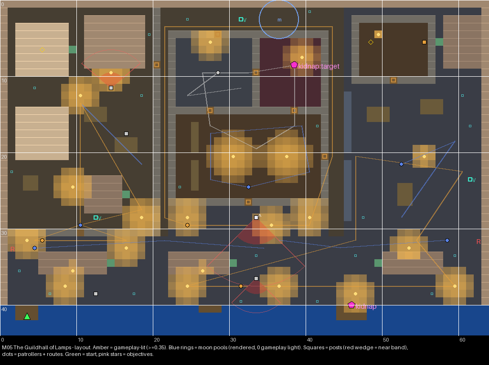
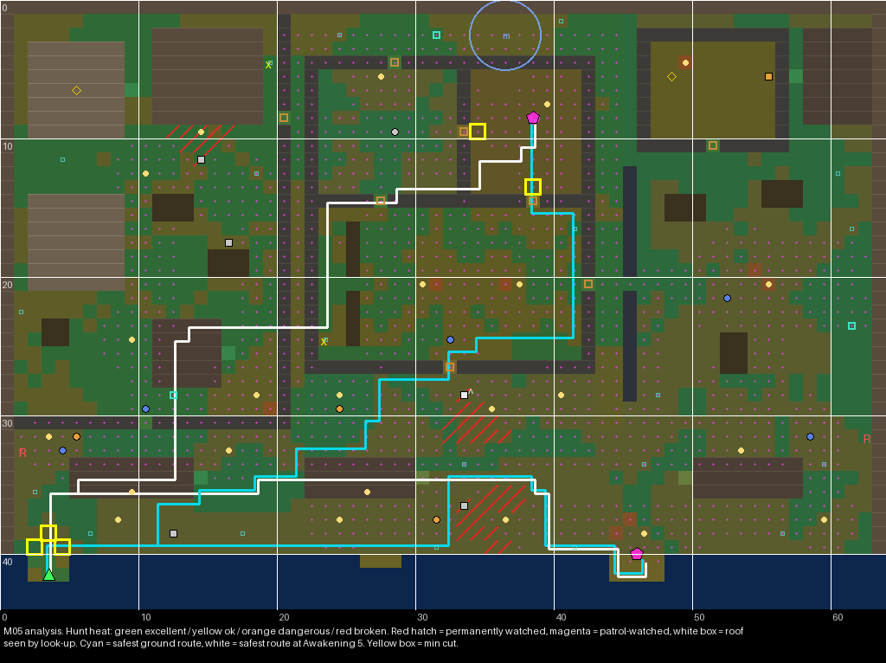

```
 N alley (GUILD main; back doors; fake moon pool) ───────────────────────── bunkhouse (Tobias's locker)
   |                 |                                                           |
 GASWORKS YARD ── clerks' office / PENROSE'S STUDY ─ hall doors ─ east lane (dark, 4 m) ─ depot yard (WHARF main, fence)
 (WORKS main,        |                                     |                     |
  gasholders ↑,   GREAT HALL (2 chandeliers, warden loop)  |                     |
  retort fire)       |                                     |                     |
   └──────────── GUILD SQUARE (Vigil envoy post, 3 lamps) ─ Guild Street + terraces (2 ping-pongs) ─┘
                                  |
 START steps ──────────── COAL WHARF (4 lamps, Tobias's circuit: protect) ─── BOAT (deliver Penrose)
```

**What works.**
- **The best mission mechanic in the campaign for level design: the carry.**
  - Carrying disables climbing (`Vampire.AreaMask`), so **the extraction must be solved on the ground**, whatever
    Ilse's Awakening.
  - It runs about 75 m from the study to the jetty, past the envoy, the street patrols and Tobias's lamp circuit.
  - The roofs help her *get to* Penrose (43% on walls at A5), and then she has to come down.
- **Light as a tool you can switch.**
  - Three gas mains each darken a district.
  - Lamplighters walk to a cut main.
  - Cutting the GUILD main **pulls Penrose out of her study into the north alley for 20 s**: a manipulation
    route made of a routine.
- **Tobias on the wharf circuit** is a moving "don't" in the extraction zone. Personal stakes become routing.

**Problems.**
- **The dark east lane short-circuits the light puzzle.** From the study: through the great hall's east and side
  doors (38,14 and 42,20), down the unlit lane between hall and depot (cols 43–44), across Guild Street to the
  jetty. That is **74 m, 2 lit cells and 3 watched cells with every lamp burning.** Shutting all three mains
  changes it by 2 cells (`special.json`). The mains are a nice optional, not the key the brief promises.
- **The south boulevard** (18 m wide, the full map width) is one giant lit band. Fine for Hunts, flat as a place.
- **All 10 patrols run over 40 s**, the longest 163 s.

**Player paths.**
- Cautious: the east lane, both ways.
- Ghost: roofs in, then the east lane.
- Predator: the hall warden, then carry.
- Manipulator: the GUILD main to draw Penrose.
- Optimiser: the east lane.
- Chaotic: a Hunt on the boulevard while carrying, then drop her and lose the objective timer.
- **Routes in diverge; the route out converges on the lane.**

**Hunt.** Excellent on the boulevard and in the yards. The hall interior is a ring of four doors.

**Fun.** Peaks: Penrose storming out; the carry past the envoy. Trough: waiting out 160 s patrols on Guild Street.

| Category | Score /10 |
|---|---:|
| Layout | 8 |
| Movement | 8 |
| Readability | 7 |
| Light | 6 |
| Patrols | 5 |
| Routes | 7 |
| Verticality | 6 |
| Hunt suitability | 8 |
| Vampire mechanics | 7 |
| Replayability | 8 |

- **Strongest area:** the carry and the GUILD main lure.
- **Weakest area:** the free dark east lane.
- **Biggest layout problem:** an unlit service lane runs from the target to the exit.
- **Biggest opportunity:**
  - put **two lamps on the east lane in the GUILD group** and a third on the Guild Street crossing in the WHARF
    group. The mains *become* the carry route, and each choice has a cost: the guild main draws Penrose and
    Moss; the wharf main draws Tobias;
  - add a lamplighter routine stop at the lane mouth.
- **Would I rebuild part of it?** **No.** Re-light the lane: lamps only, a Small change.

### M06 — Masquerade at Ashcombe House (Act II, Awakening 4–5)

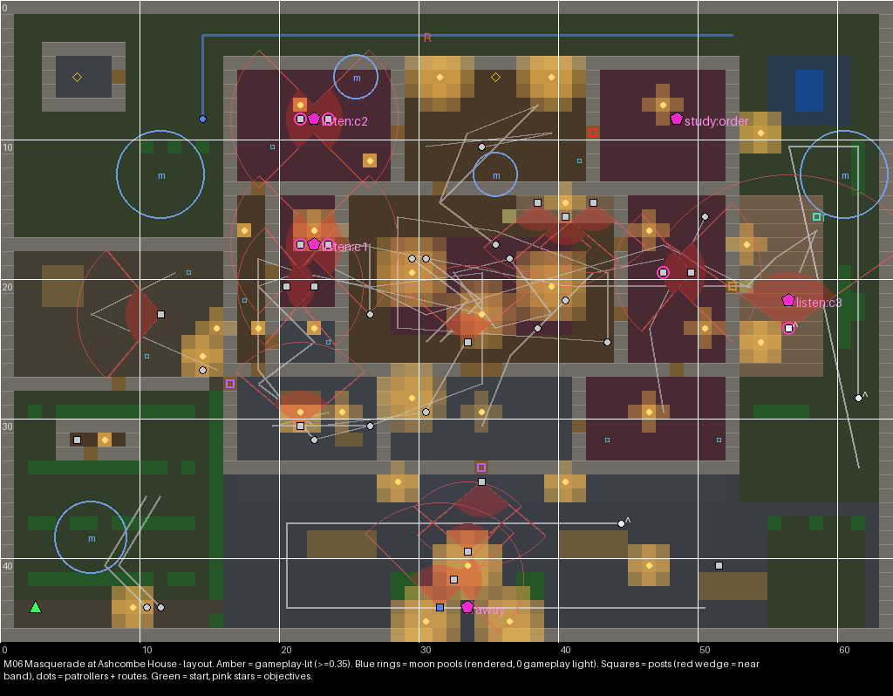
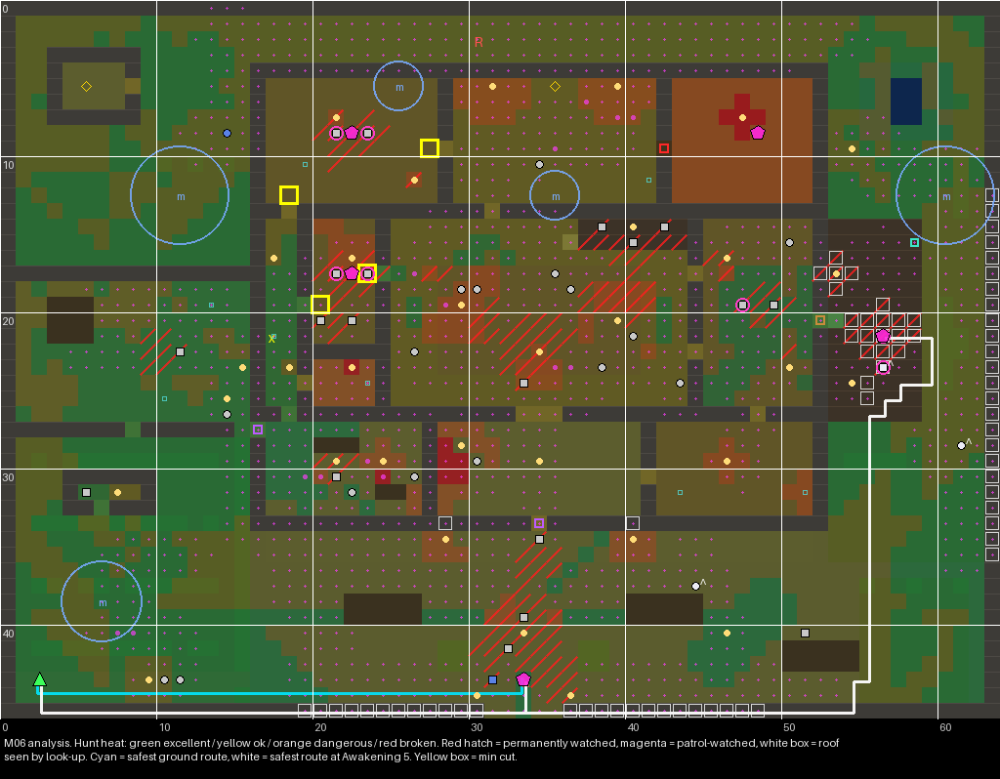

```
 ice house (shrine) ── north lawn (gamekeeper, 236 s loop) ───────────────────── east garden / pond (hunter)
       |              ┌──────── ASHCOMBE HOUSE (threshold zone, all heights) ───────┐          |
 kitchen yard ── kitchen door ─ service passage ─ library (c2) ─ long gallery ─ STUDY (locked)  TERRACE (c3: Ashcombe + Vane;
 (restricted;   (thrall invite)  card room (c1) ─ BALLROOM (3 chandeliers) ─ drawing room ─────────  rail trap)
  smoking footman)              entrance hall (front door: invitation + mask)
 hedge garden (START; the mask) ─────── carriage drive (invitation in a coach; hunter; gate post) ── EXIT gates
```

**What works.**
- **Thresholds and social stealth as level design.** There are two ways in, each a puzzle:
  - the invitation in a coach plus the mask on a sleeping guest;
  - the smoking footman as a thrall-key at the kitchen door.

  Restricted rooms, listen points sized for "stand within 6–9 m for the whole exchange", the study key in the
  pantry, and Vane on the terrace (masks don't fool him) complete it.
- **A routine** (Ashcombe's 45 s terrace dwell) **feeds an accident** (the loose rail). The rail is sealed while
  Vane stands there, and he leaves when c3 completes: the best scripted space in Act II.

**Problems.**
- **Once invited, the interior walls are a catwalk over the party.** At Awakening 5 every listen point is within
  range of a wall top, and the study can be entered over its wall. The masque's whole rule set (masks, restricted
  rooms, a locked door) stops mattering (§3.3).
- **The estate's perimeter wall is the safest way out**: 63% of the exit route.
- **41 NPCs with overlapping cones in the ballroom.** For a masked player most of those cones don't apply. Nothing
  tells her that at WASD speed.

**Player paths.**
- Cautious: front door, then listen from the alcoves.
- Ghost: kitchen thrall, then wall tops.
- Predator: feeds on drunk guests, kills Ashcombe by the rail.
- Manipulator: the thrall footman.
- Optimiser: wall tops after any invitation.
- **Two genuine entries, then the catwalk flattens them.**

**Hunt.** Weak. Inside the house the Watch follows (the threshold has been opened), and the estate has one gate
exit plus walls.

**Fun.** Peaks: the invitation dance; the rail. Trough: cone soup in the ballroom.

| Category | Score /10 |
|---|---:|
| Layout | 7 |
| Movement | 6 |
| Readability | 5 |
| Light | 6 |
| Patrols | 5 |
| Routes | 8 |
| Verticality | 3 |
| Hunt suitability | 5 |
| Vampire mechanics | 9 |
| Replayability | 8 |

- **Strongest area:** the two thresholds and the terrace.
- **Weakest area:** the post-invitation catwalk.
- **Biggest layout problem:** open-topped interior walls.
- **Biggest opportunity:**
  - a **roofed house** (with §13 #1), where the designed vertical layer is the **musicians' gallery and a servants'
    back stair**: one place to overhear the ballroom from above, at a price (lit by the musicians' candles,
    watched by the fiddler);
  - in the cone layer, **masked-and-behaving hides civilian cones** to the near sector only (SR.6 rule), so the
    ballroom reads.
- **Would I rebuild part of it?** **No.** It needs the tile fix plus a gallery: Small after the engine change.

### M07 — The Toll Bridges (Act II, Awakening 5–6) — best current level

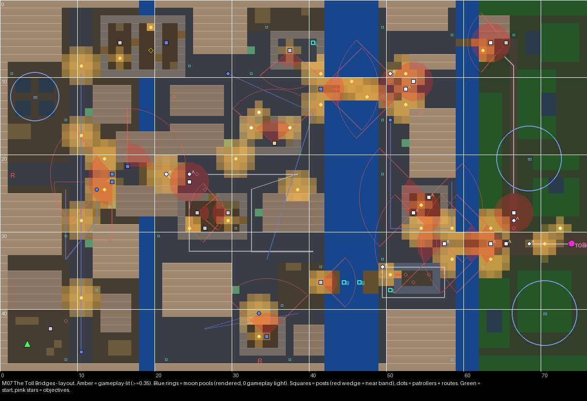
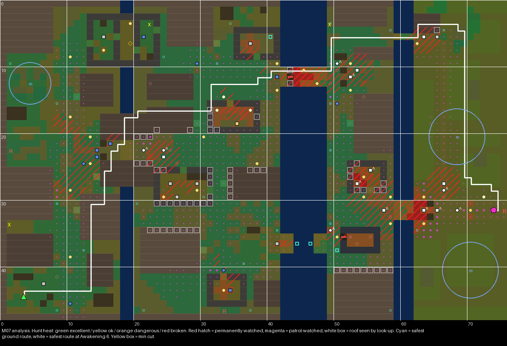

```
 TANNERS' ROW ─┬─ Leat Bridge (Pell + 2 posts) ────┬─ CHANDLERS' ISLAND ─┬─ TOLL BRIDGE (chain: lever / thrall / lit arch) ─┬─ OSTBANK WHARF ─┬─ causeway (hunters both ends, braziers) ─┬─ FENS ─ FEN ROAD
 (START)       ├─ leat-house roofs (hunter looks up) ┤  Wick, chapel (holy), ├─ ferry skiff (down Jory, any way) ─────────────┘  bridge foot,   └─ lock-gate catwalk (dark; chained hound) ─┘  (dyke hunter + hound)
               └─ mill wheel room (sleepers; shrine) ┘  hunter + hound loop                                                    guard hut, Faithful pen
```

**Why it works.** See §5.
- Four banks and three rivers make **seven crossings** (Leat 3, Ost 2, Fen Cut 2)**, each with a different cost and a different build answer**:
  force (the Leat Bridge), route (roofs, the mill), social (a thrall on the lever), evidence (down Jory quietly),
  darkness (the lock catwalk).
- **It is the only mission where the safest route at the expected Awakening still crosses 14 watched cells.**
  Running water makes every bank a fresh problem, and the roofs can't jump a river.
- **The Vigil is taught where it matters.** Look-up hunters at the leat-house roofs and the bridge foot; hounds on
  routes where water breaks scent.

**Problems.**
- **Readability load.** 36 active NPCs (48 with the Dossier); 12 look-up hunters; four hounds.
  - At the Ostbank bridge foot, 2 hunters, a hound and braziers stack three cones on one landing. That is a
    cone wall, with one timing answer unless the player brings a tool.
- **Long ping-pongs** on the Row (9 → 45 rows, 121 s).
- **Chandlers' Island is a big open middle.** The crossing problems are at its edges; its centre is a walk.

**Player paths.**
- Cautious: mill or lock catwalk.
- Predator: Leat Bridge and causeway by force.
- Ghost: leat-house roofs, then the arch.
- Manipulator: the toll lever by thrall, the ferryman.
- Optimiser: toll bridge plus north roofs plus the lock catwalk.
- Chaotic: a Hunt pinned against water: "dangerous by design".
- **Five distinct lines. The template.**

**Hunt.** Banks are excellent (alleys, roofs, the Wick's two doors). Crossings are dangerous by design: the water
blocks *her* escape. Keep that, but give each bridge foot a dark drop under the abutment as a break.

**Fun.** Peaks: the toll arch climb in the lamplight; the catwalk past the chained hound. Trough: crossing the
island centre.

| Category | Score /10 |
|---|---:|
| Layout | 9 |
| Movement | 7 |
| Readability | 6 |
| Light | 7 |
| Patrols | 6 |
| Routes | 9 |
| Verticality | 7 |
| Hunt suitability | 7 |
| Vampire mechanics | 9 |
| Replayability | 9 |

- **Strongest area:** the Leat crossings (three answers, three trees).
- **Weakest area:** the Ostbank bridge foot (stacked cones).
- **Biggest layout problem:** none structural. Density at two landings.
- **Biggest opportunity:**
  - make Chandlers' Island a **destination**: the Wick as a feeding hub with an upstairs, and the chapel's holy
    light as a moving procession at midnight;
  - add a **dark abutment ledge** under each bridge for Hunt breaks and drop-feeds.
- **Would I rebuild part of it?** **No.**

### M08 — Hollin's Hunt (Act II finale, Awakening 5–7)

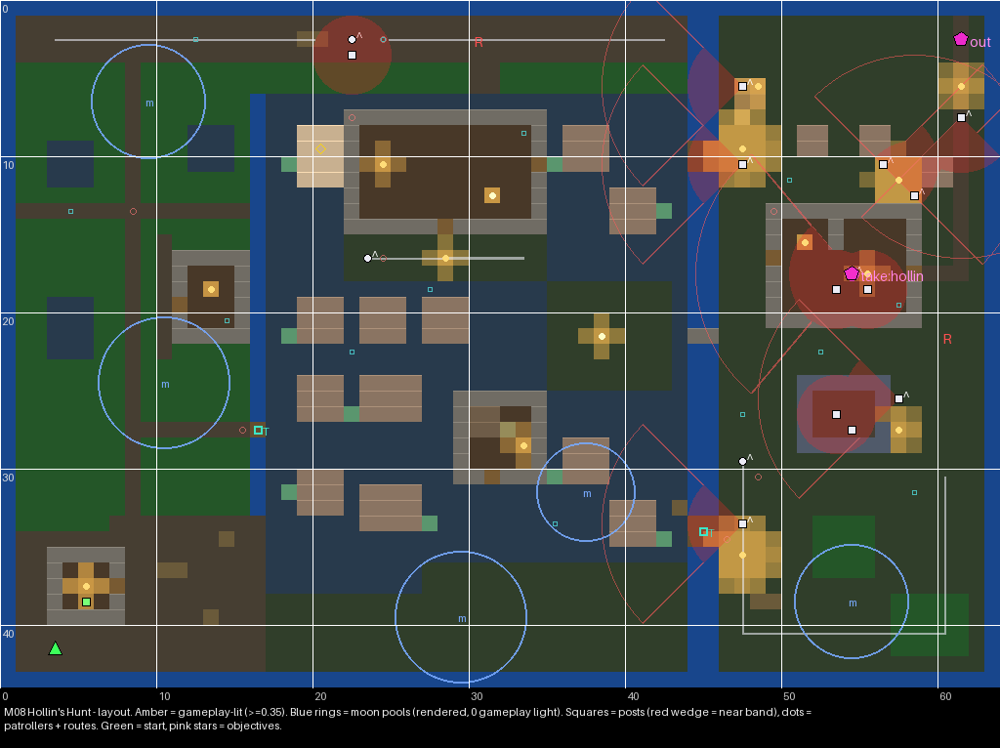
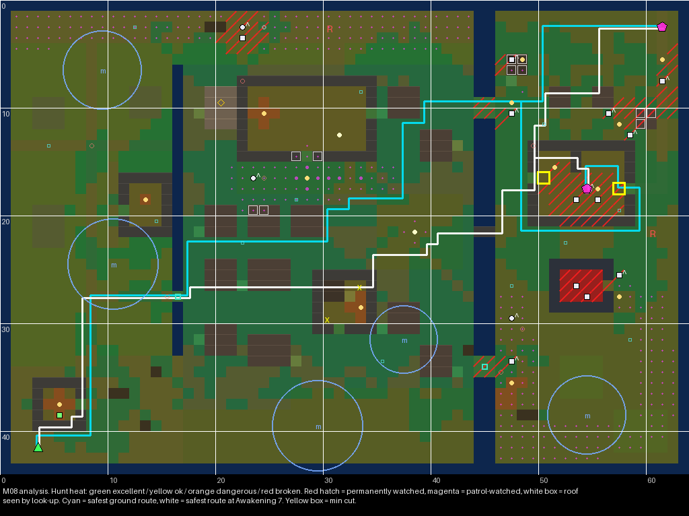

```
 FLOOD DYKE (hunter + hound ping-pong) ═══════════════════════════════════════════ watch platform
   |                            |                                            |
 REED BEDS ─ PLANK BRIDGE ─ DROWNED VILLAGE (knee water; cottage roofs a leap apart; ─ FOOTBRIDGE ─ VIGIL CAMP: barn (journal), fire,
 (concealment)  (trap)        St Aud's tower ↑ shrine; Marrow house: candle bait)    ─ WEIR WALL ──  tents, kennels ─ DROVE ROAD (exit)
   |                                         |                                     ─ SLUICE BRIDGE (trap)
 START causeway, Tamsin's hut ─────── green / orchard ──────────────────────────────┘
                 ← Hollin hunts across all of it: a scent fix every 18 s, two hounds, rain squalls →
```

**What works.**
- **The level is the Hunt.** Hollin's scent fixes turn the whole map into pursuit space. The two traps (sawn
  planks, the sluice) let the player **choose where to be found**. Rain squalls change the rules on a clock.
  This is the closest thing the game has to the redesign's §33.1 showcase.
- **The Marrow house candle** is a personal object that gives an instant fix: bait as story.

**Problems.**
- **The village is a grid of near-identical cottage blocks in uniform knee-deep water.**
  - Low spatial memory ("which cottage?").
  - Every step in the village splashes, so the sound layer has no texture: no quiet lanes, no loud fords to choose
    between.
- **The darkest map (4.4% lit) has five fake moon pools.** They are the only visual light in most of it.
- **The camp is a fortress of posts** (80% static): fine as an objective, but its three entrances are each a
  brazier and posts.

**Player paths.**
- Cautious: hides in the reeds and lures Hollin to the planks.
- Predator: feeds on the hounds' handlers and fights.
- Ghost: weir wall to the camp.
- Manipulator: False Trail and the candle.
- Optimiser: sluice trap.
- Chaotic: chased into the village, which works.
- **Varied.**

**Hunt.** Excellent by construction. The village rings and the leapable roofs give re-entry.

**Fun.** Peak: Hollin walking onto the planks. Trough: wading across identical blocks.

| Category | Score /10 |
|---|---:|
| Layout | 7 |
| Movement | 6 |
| Readability | 5 |
| Light | 5 |
| Patrols | 6 |
| Routes | 7 |
| Verticality | 6 |
| Hunt suitability | 9 |
| Vampire mechanics | 8 |
| Replayability | 7 |

- **Strongest area:** the traps and the Cut crossings.
- **Weakest area:** the uniform village grid.
- **Biggest layout problem:** sameness: equal cottages, equal water.
- **Biggest opportunity:**
  - **vary the water.** Dry causeway lanes are quiet but exposed; deep fords are silent for Mist but block hounds'
    scent; knee water is loud.
  - Make three cottages distinct landmarks: the drowned chapel, the Marrow house, the mill.
  - Make moonlight real on open water: the fen is the one place the moon should matter.
- **Would I rebuild part of it?** **Yes: the village grid**, by re-cutting water depth and landmark buildings.
  Medium.

### M09 — Coldwater, Above (Act III, Awakening 6–8)

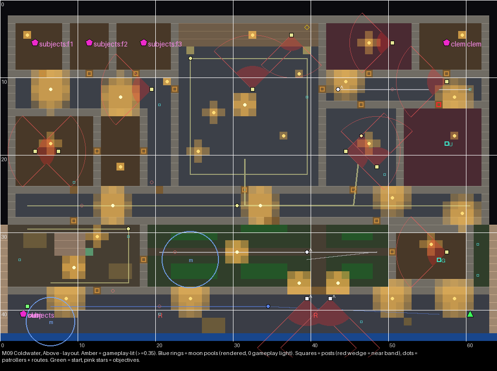
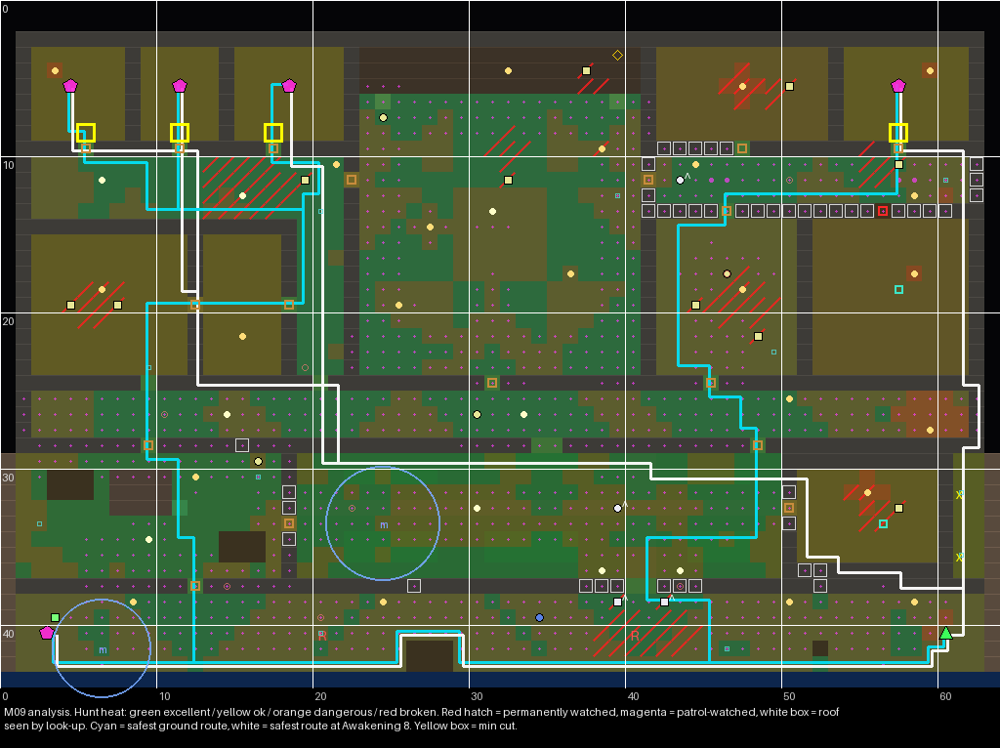

```
 WARD C: 3 cells ─ sunstone corridor (r7 ×2) ─ orderlies' station │ LAB (sunstone, alchemist; obs. gallery ↑ shrine) │ east wing: library / CLEMENT / dispensary / STUDY (locked)
        └──────────────────── doors ──────────────── LONG GALLERY (2 sunstones, orderly) ─────────────────────────────┘
                                                            | doors
 COAL YARD (sunstone) ─── PHYSIC GARDEN (sunstone, hunter) ─── MAIN GATE (2 sunstones, 2 hunters) ─── GENERATOR HOUSE (breaker + engineer)
       |                                                                                                  |
 EXIT Tobias's cart ──────────────────────── Coldwater Lane (watchman) ────────────────────────────── START
```

**What works.**
- **The escort is a level-design device.** Fledglings can't climb and burn in sunstone, so the player must make the
  ground safe for someone else.
- **The generator and its engineer** (posted beside the breaker) or a thrall's smash are the keys. The analysis
  confirms the design: for all three fledglings, the minimum-burn route out of Ward C *is* the shortest route
  (10, 5 and 1 burning cells). The sunstones can't be walked round; they have to be dealt with.
- **Sunstone light is the best "law as light" in the game:** burning, unsnuffable, smashable by thralls.

**Problems.**
- **"The upper floor" is flat.** Rows 0–26 are ground-level tiles behind a wall, so the wards are not above
  anything, and the building has no second level apart from the lab's observation deck. The verticality is the
  open-topped walls (§3.3), which Ilse uses to skip everything.
- **Eight dead-end rooms** (cells, the study, the station, the dispensary) behind single doors. Prisons should feel
  trapped, but a Hunt in Ward C is a cornering.
- **Clement's route is 180–192 m**, on foot, through the lab or the gallery, past rooms already cleared: an escort
  walk-back.

**Player paths.**
- Every build cuts the generator. The engineer is posted beside it, so the decision is "deal with Ambrose or
  race him".
- The Manipulator smashes lamps with a thrall.
- The Predator turns the fledglings loose.
- **Routes converge on the gallery.**

**Hunt.** Poor indoors; good on the grounds and the lane.

**Fun.** Peaks: throwing the breaker and leading three starved things out; turning one loose. Trough: Clement's
long walk.

| Category | Score /10 |
|---|---:|
| Layout | 6 |
| Movement | 6 |
| Readability | 6 |
| Light | 8 |
| Patrols | 5 |
| Routes | 6 |
| Verticality | 4 |
| Hunt suitability | 4 |
| Vampire mechanics | 8 |
| Replayability | 6 |

- **Strongest area:** Ward C plus the generator decision.
- **Weakest area:** the east wing walk.
- **Biggest layout problem:** a flat box of rooms pretending to be an upper floor.
- **Biggest opportunity:**
  - make the wards a **real `u` upper level** over the ground-floor offices, with **two stairs and a coal chute**
    to the yard (a fledgling exit that skips the gallery);
  - move Clement's quiet room **beside the east stair**, so the two escorts pull in opposite directions;
  - put a second exit at the east end of the lane (the cart could wait at either).
- **Would I rebuild part of it?** **Yes: the building interior.** Medium–Large.

### M10 — The Gasworks (Act III, Awakening 6–8)

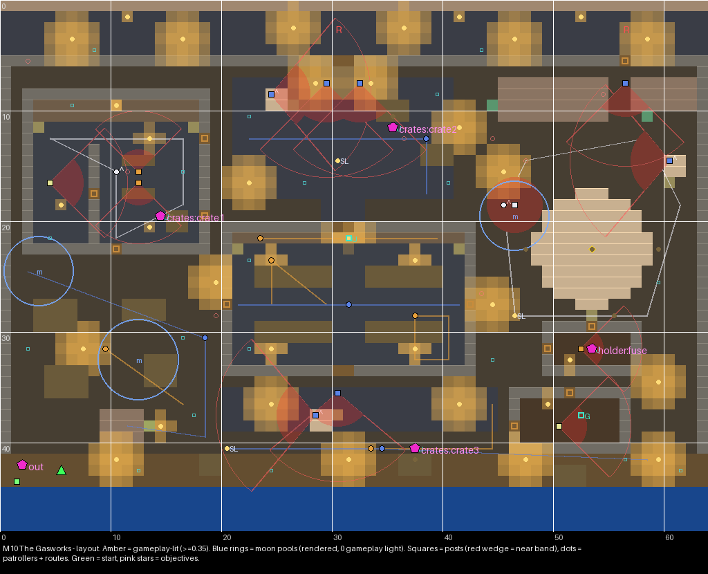
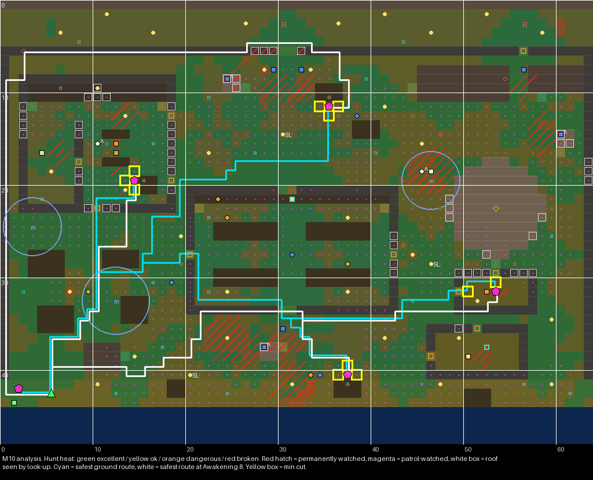

```
 GASWORKS ROAD (city lamps; main gate + side gate) ════════════════════════════════════════
   |                    |                              |
 MANUFACTORY         LOADING YARD (crate 2 on a dray, SL1 tower)    mess / coal sheds (roofs)
 (crate 1, drying gallery, office)  |                              |
   |                 RETORT HOUSE (furnaces, charging stage, whistle) ── GAS HOLDER (9 m; fuse at the valve house, SL2, shrine)
 COKE YARD ───────────────── | ──────────────────────────────── ENGINE HOUSE (dynamo: all searchlights)
   |                         |                                    |
 START / EXIT boat ── WHARF (crate 3, SL3) ───────────────────────┘
```

**What works.**
- **Searchlights** with operators, plus a dynamo that kills all three: the open-yard counter the other maps lack.
  They watch roofs and yards and can be switched off at a price.
- **The fuse run**: 60 s from the holder in the east to the boat in the west. The blast lights fires and the works
  go dark. **A designed reverse traversal through a changed world:** the best exit in the campaign.
- **Evacuation** (8 workers, the whistle) is a herding sub-game the space supports: wide yards, gates.

**Problems.**
- **Objectives in four separate districts** (crate 1 west, 2 north, 3 south, the fuse east): a checklist tour.
- **Big rectangular yards and boxes.** Readable, but every district is the same shape.
- **Few laws:** the river is only the exit.

**Player paths.**
- Cautious and Ghost: the coke yard → manufactory → road → loading yard → retort → holder loop.
- Predator: the yards.
- Manipulator: workers as thralls.
- The dynamo changes all routes.
- **Converge on the clockwise tour.**

**Hunt.** Excellent: yards with 3+ exits, and junctions everywhere.

**Fun.** Peaks: the dynamo; the fuse run. Trough: the third crate.

| Category | Score /10 |
|---|---:|
| Layout | 7 |
| Movement | 8 |
| Readability | 6 |
| Light | 8 |
| Patrols | 5 |
| Routes | 7 |
| Verticality | 6 |
| Hunt suitability | 8 |
| Vampire mechanics | 5 |
| Replayability | 7 |

- **Strongest area:** the holder and the dynamo.
- **Weakest area:** the crate tour.
- **Biggest layout problem:** objective spread.
- **Biggest opportunity:**
  - put crates 2 and 3 **on the same dray route**, so the dray moves from the loading yard to the wharf on a timer.
    One objective becomes a moving target and the map gets a routine;
  - add a **culvert under the retort house**, still water, as a second fuse-run route.
- **Would I rebuild part of it?** **No.**

### M11 — The Opera of Lanterns (Act III, Awakening 7–8)

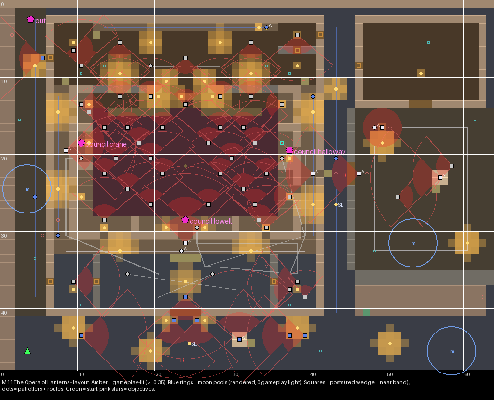
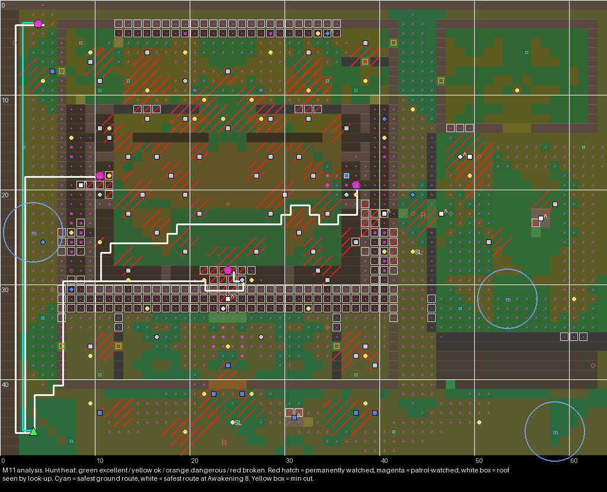

```
 EXIT (lane, N) ─ STAGE DOOR LANE ─ stage door ─ STAGE HOUSE (lit stage; wing stairs ↑; fly gallery ↑ shrine; dressing room) ─ dock door ─ Lantern St
 START (lane, S)    |                     |                         |
                 cloakroom ─ W TIER (CRANE + Vigil guard) ═ STALLS (20 seated, facing N) ═ E TIER (HALLOWAY, the rail) ─ private stair ─ VIGIL COACH YARD (SL2, hound)
                    |                     └──────── grand tier ─ ROYAL BOX (LOWELL, holy) ───────┘                                 (the targets flee here)
                 FOYER (sergeant, chandelier) ─ bar ─ front doors ─ THE SQUARE (SL1, braziers)
```

**What works.**
- **The box tiers are a designed second floor** (`u` galleries) with corridors behind them. It is the one interior
  where the vertical layer is authored *as a place*, with targets on it.
- **The window plus the crescendo** make a spatial timing puzzle: three targets about 25–40 m apart around a U,
  ninety seconds, a swell every 80 s.
- **Escape routes for the targets** (the coach yard via the private stair) mean failure has a geography.

**Problems.**
- **74 active NPCs, 60 of them posts:** 20 seated guests all facing the stage, box guests, servants. The masked
  rule makes most of them harmless, but the contextual-cone budget (4) has to choose among dozens.
  **Cone soup.**
- **The opera's `H` shell is climbable and walkable.** At A8 the shell plus the tiers form a ring that reaches all
  three boxes from above: 6 ground cells to Crane, 6 to Lowell, 2 to Halloway.

**Player paths.**
- Every build converges on the tiers (correctly).
- The Manipulator's thralls make it sing.
- A solo Predator needs Dash between tiers.

**Hunt.** Poor during the window by design. The crowd panics, and the stage house is the break.

**Fun.** Peak: the synchronized strike in the swell. Trough: reading the stalls.

| Category | Score /10 |
|---|---:|
| Layout | 8 |
| Movement | 6 |
| Readability | 4 |
| Light | 7 |
| Patrols | 5 |
| Routes | 7 |
| Verticality | 8 |
| Hunt suitability | 6 |
| Vampire mechanics | 7 |
| Replayability | 8 |

- **Strongest area:** the box tiers.
- **Weakest area:** the stalls' readability.
- **Biggest layout problem:** a walkable outer shell.
- **Biggest opportunity:**
  - a **roofed shell**, so the designed vertical route is the tiers, the flies and the wings, not the roof;
  - **guests' cones near-only while she is masked**;
  - a fly-gallery **drop onto the stage** as the loud, glamorous fourth approach.
- **Would I rebuild part of it?** **No.** Tile fix plus cone-display rule.

### M12 — Vane's Bastion (Act III finale, Awakening 7–9)

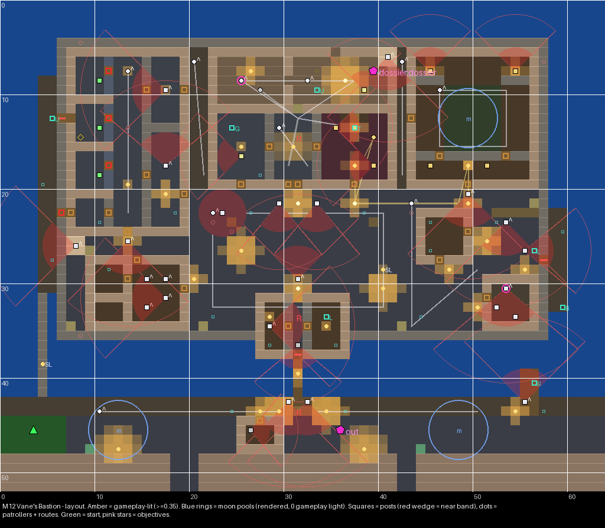
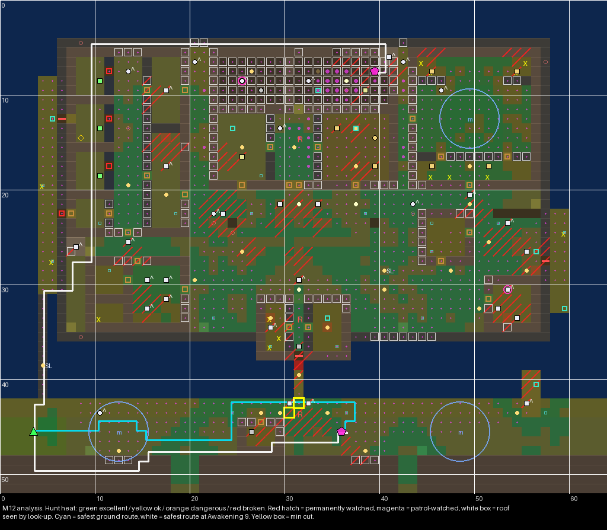

```
                       ~~~~~~~~~~~~~~ the Vesper ~~~~~~~~~~~~~~
   west ledge ─ PRISON (3 cells, postern) ═ curtain wall-walk (3 m, all round) ═ KEEP (hall, chapel, ARCHIVE ↑ 3 sunstones, SL) ═ cloister ─ east ledge
   (outfall grate)   |                              |                                                                     (water-stair gate)
   WEIR WALL ← SL    barracks ─ BAILEY (braziers, SL) ─ kennels                                                                  ↑ skiff
                                        |
                                   GATEHOUSE (portcullis windlass; Brother Anselm)
                                        | causeway
   START towpath ── weir foot ── bridgehead toll-house ── jetty (boatman) ─────── EXIT east of the reeds
```

**What works.**
- **Three crossings mapped to three builds:** the weir for route and Mist; the skiff by downing the boatman; the
  causeway via Anselm's windlass. Each lands at a different face of the island.
- **The archive's river door onto the wall-walk** is a designed vertical route, and it is watched by a searchlight.
- **Vane's chapel routine plus the sanctuary-lamp trap** is the act's best target design.

**Problems.**
- **The searchlights carry the whole defence.**
  - Without them the archive is 0 watched cells via the weir and the curtain walk.
  - With the sweep modelled it is 14 cells, but those are **timed**, not decided: wait for the beam.
  - The skyline rule (§3.2) would make the wall-walk a contested place rather than a timing lane.
- **Twelve dead-end spaces** (cells, the question room, stores) and 30 doors: an interior thicket for a Hunt, on an
  island where water also blocks her.
- **At A7+ the curtain wall makes all three gates (portcullis, water-stair, outfall) one answer: climb.** The
  design notes accept this for the weir; it erases the skiff and the causeway as *choices*.

**Player paths.**
- Cautious and Ghost: the weir and the walk.
- Predator: the causeway by force.
- Manipulator: Anselm.
- Optimiser: the weir.
- **Two of three entries are rarely chosen.**

**Hunt.** Dangerous by design: an island fortress. Fine, but the prison needs its postern loop open from inside.

**Fun.** Peaks: Vane at prayer; the archive choice. Trough: waiting for searchlight beats.

| Category | Score /10 |
|---|---:|
| Layout | 8 |
| Movement | 7 |
| Readability | 6 |
| Light | 7 |
| Patrols | 6 |
| Routes | 7 |
| Verticality | 7 |
| Hunt suitability | 5 |
| Vampire mechanics | 9 |
| Replayability | 8 |

- **Strongest area:** the keep and chapel.
- **Weakest area:** the prison block.
- **Biggest layout problem:** the curtain wall equalises the three crossings.
- **Biggest opportunity:**
  - **ward the curtain.** A Dossier-proof "salt along the wall-walk" segment between the weir landing and the keep,
    which a thrall can break or Silverblood ignores. The weir stops being free, and the skiff and causeway become
    real alternatives. This is also the first **salt-as-geometry** use (§3.10).
- **Would I rebuild part of it?** **No.** Add the ward segment and the skyline rule.

### M13 — The Long Night (Act IV, Awakening 8–9)

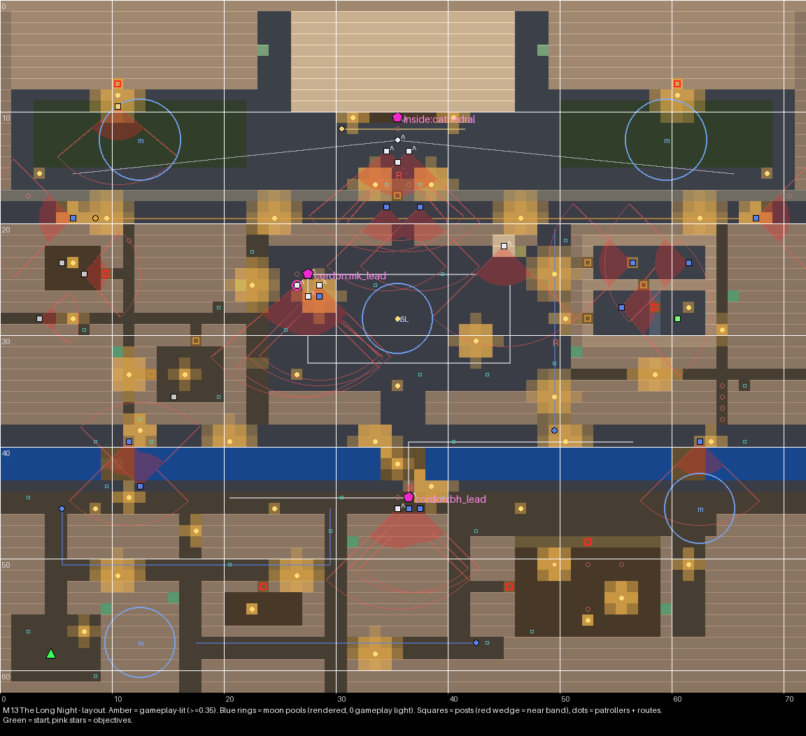
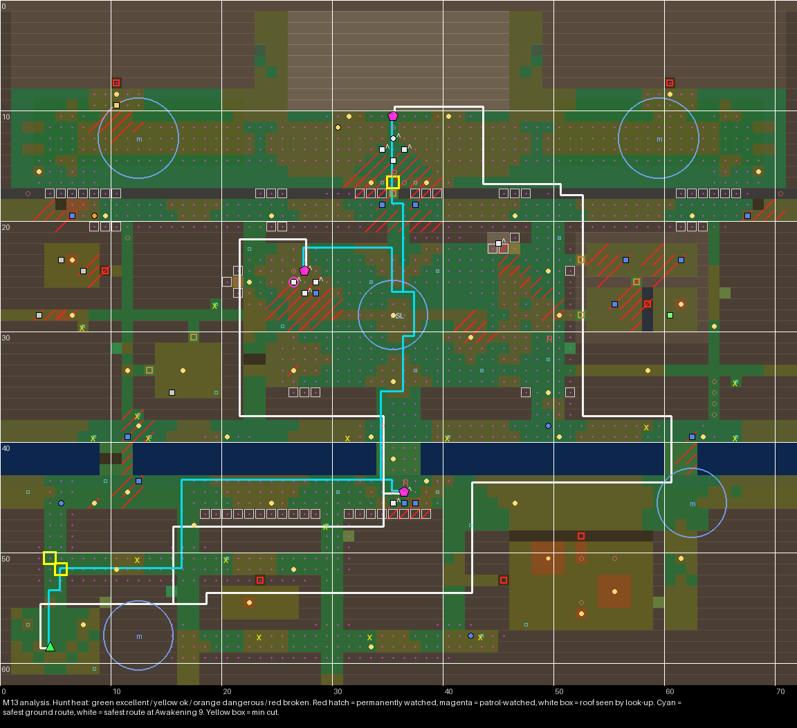

```
 churchyard ─ Bishop's palace ─ CATHEDRAL WEST DOORS (close squad; Vane if alive) ─ chapter house ─ churchyard
       └── close wall (stairs at both ends of Lantern Street) ───────────────┬──────────────────────┘
 LANTERN STREET ─────────────────────────────────────────────────────────────┤
 Rope Walk ─ Pewter Alley ─ MARKET SQUARE (SL tower; market squad) ─ dyer ─ Hallorans (barred) ─ Watch-house (Nell's lock-up)
       |                |                    |                          |
 Weavers' Bridge (barricade gap) ─── MERCY BRIDGE (bridge squad) ─── Lock Bridge (the raid crosses)
 ~~~~~~~~~~~~~~~~~~~~~~~~~~~~~~ the Mercy canal ~~~~~~~~~~~~~~~~~~~~~~~~~~~~~~
 Quay Lane ─ Sallow St ─ Low St ─ sexton's house ─ CANDLE ROW (Tobias's barricade; 180 s raid)
 START (the Wick)
```

**What works.**
- **The squads make the objective an engagement.** "Break" needs fear or blood, so roofs are a *hunting platform*,
  not a bypass. That is the right Act IV fantasy: "districts the player can dominate, with hunters trying to
  contain her".
- **The Candle Row raid countdown** is a second, moving front that pulls the player across the canal.
- **A real city:** canal, three bridges, market, close wall. It is drawable after one play.

**Problems.**
- **A carpet of `h` roofs with 1–2 cell streets.** Every street is leapable, so the whole city is one roof at A9.
  The look-up squads can see her only in their 7 m near sector (§3.2). **The squads can't contain a roof-walker**,
  which turns "they hunt me" into "I choose when".
- **No thresholds.** Curfew citizens behind barred doors are *locked*, not *homes*. The redesign's "Faithful homes
  as escape hatches" (§21) belongs exactly here, and isn't authored.
- **Moon pools** (5) on the close and the Wick.

**Player paths.**
- Predator: drops on the bridge squad.
- Ghost: roofs to the close.
- Terror-only: scatters the squads.
- Manipulator: a thrall in a squad.
- Chaotic: a squad ring.
- **Varied, because the objective forces contact.**

**Hunt.** Excellent: junctions, bridges, roofs. Too easy to break by climbing.

**Fun.** Peaks: a squad ringing up back to back; Candle Row. Trough: roof-walking unchallenged.

| Category | Score /10 |
|---|---:|
| Layout | 7 |
| Movement | 7 |
| Readability | 6 |
| Light | 6 |
| Patrols | 7 |
| Routes | 8 |
| Verticality | 6 |
| Hunt suitability | 8 |
| Vampire mechanics | 6 |
| Replayability | 8 |

- **Strongest area:** the canal and its bridges.
- **Weakest area:** the undifferentiated roof carpet.
- **Biggest layout problem:** roofs the squads can't contest.
- **Biggest opportunity:**
  - **three lit roof-crossings** (a searchlight sweep on Lantern Street, braziers on the bridges, a watch-tower
    sentry over the market). The roof network becomes three islands joined by exposed gaps;
  - **three Faithful threshold homes** in the Wick, open to her as Hunt escape hatches (Rumour), barred to the
    Watch.
- **Would I rebuild part of it?** **Partly: the Wick and market roof network**, cutting it into islands. Medium.

### M14 — The Abbess Beneath (finale, Awakening 8–10) — weakest current level

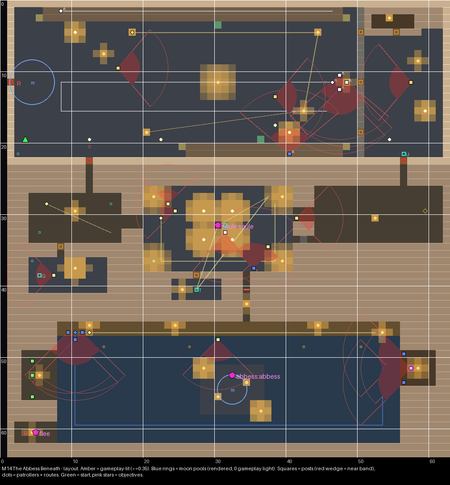
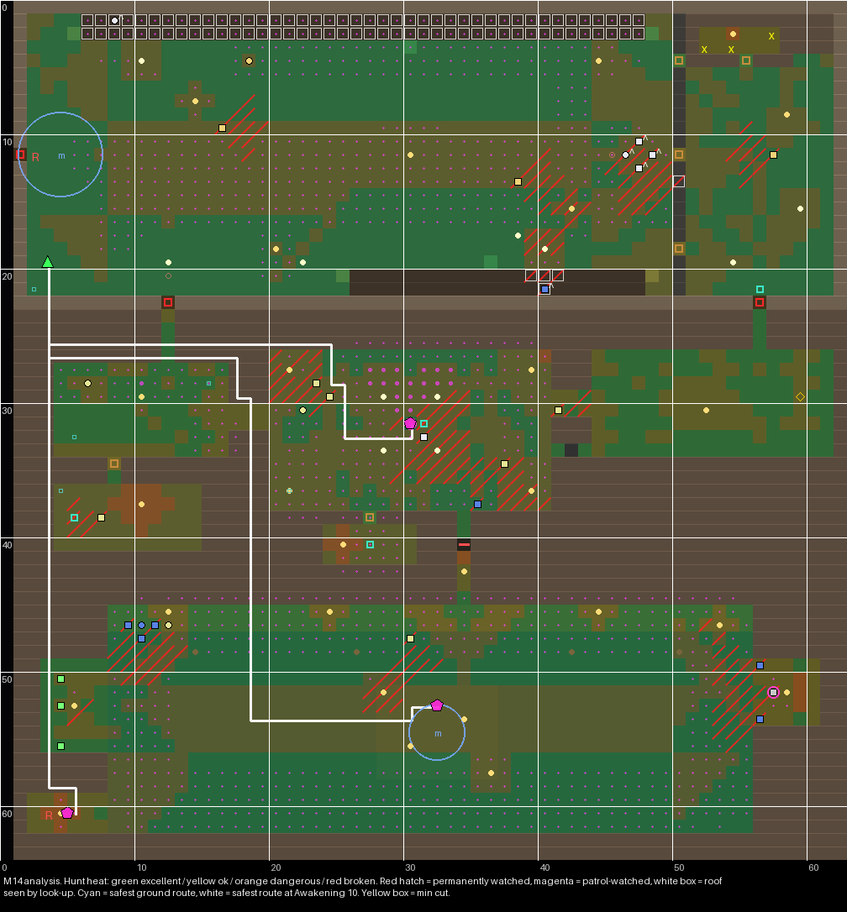

```
 west door (locked) ─ NAVE (4 sunbeams creep north from 5:00; squad; canons; triforium sentries) ─ chancel ─ vestry (key)
                         |                                                  |
           sexton's stair (locked: key / Ashby)                    bricked stair (8 s, loud deed)
                         | 1-cell shaft                                     | 1-cell shaft
          ossuary (shrine) ─ charnel ─ boiler room (generator) ─ SAULE'S LAB (sunstone ring) ─ purge chamber (trap)
                                               |
                                         VAULT GATE (winch)
                                               |
          river door (EXIT) ─ FLOODED VAULT (vats, Council squad, Pike's gallery, fledgling pens, THE ABBESS)

  What the nav allows from Awakening 4: crawl the nave's 9 m south wall → walk the rock → drop into any room below.
```

**What works.**
- **The sunbeams** are the best light in the game. Dawn as a spatial clock: four burning pools creep across the
  nave from 5:00 to 10:00, closing the floor a beam at a time.
- **Saule's loop** (desk → ring → purge gauge) plus the purge accident and the generator ring is a fine target
  encounter.
- **The vault's choice** and the destroy countdown give the finale its exit.

**Problems.**
- **P0: the descent is optional.** See §3.3. At its expected Awakening (8–10), the safest routes to Saule, the
  Abbess and the river door run 57–73% over the rock above the undercroft. That bypasses:
  - the bricked stair;
  - the sexton's stair;
  - Ashby's Faithful branch;
  - the vault gate.

  **Three stages become one drop.**
- **Even as intended, the descent is linear:** nave → one of two 1-cell shafts → undercroft rooms → one gate → the
  vault.
  - The shafts are the narrowest spaces in the campaign.
  - The undercroft has 4 dead-end rooms.
  - A Hunt there is a cornering, and the redesign's Act IV is supposed to be the *least* corridor-like.
- **The vault is one big flooded hall** with a gallery: open, readable, but a cone arena.

**Player paths.**
- As built: every player at A4+ crawls the wall.
- As intended: the Cautious player takes the sexton's stair; the Predator breaks the bricks; the Manipulator sends
  a thrall into Saule's ring.

**Hunt.** Broken in the shafts and the purge chamber. Acceptable in the nave and the vault.

**Fun.** Peaks: the sunbeams; Saule in his own purge. Trough: the 1-cell stairs.

| Category | Score /10 |
|---|---:|
| Layout | 4 |
| Movement | 6 |
| Readability | 6 |
| Light | 8 |
| Patrols | 5 |
| Routes | 3 |
| Verticality | 2 |
| Hunt suitability | 4 |
| Vampire mechanics | 7 |
| Replayability | 4 |

- **Strongest area:** the nave under the sunbeams.
- **Weakest area:** the shafts and the undercroft.
- **Biggest layout problem:** walkable rock above an "underground".
- **Biggest opportunity:** a descent with **three real ways down that land in three different places**, and an
  undercroft built as a **ring** around Saule's laboratory (§10.1).
- **Would I rebuild part of it?** **Yes: the descent and the undercroft.** Partial rebuild, Medium–Large, after the
  tile fix.

---

## 5. Best current level: M07 The Toll Bridges

What makes it work is **its spatial structure, not its variety**:

1. **A chain of "banks and crossings"** in which every link is a self-contained decision with its own enemy mix,
   light and build answers. The banks are rest spaces (rings, roofs, feeding). The crossings are the tests.
   That gives natural pacing (tension, release, tension) and a map the player can draw.
2. **A hard law that the vertical layer can't cheat.** Running water blocks leaps, Dash and Mist, and roofs that
   span water are *authored* (leat-house, mill, toll arch). So verticality stays a choice inside each bank and
   becomes a *crossing type* at the edges. It is the only map where the roof-preferred route still pays 14 watched
   cells.
3. **Every crossing offers different-tree answers** at different prices:
   - force: the Leat Bridge, the causeway;
   - route: roofs, the mill, the lock catwalk;
   - social: a thrall on the toll lever;
   - evidence: down Jory and take his skiff.

   This is the §25 test passing in level form.
4. **The objective is the far side.** No walk-back, no checklist.

**Principles to export:**
- **Make every major objective sit behind a law-shaped boundary** the roofs don't cross: water, a threshold, holy
  ground, a ward, a carry, an escort.
- **Alternate "bank" spaces with "crossing" spaces.**
- **Author one vertical crossing per boundary, and make it lit or watched.**

**Runner-up: M05.** Its carry turns off the roof layer exactly when the mission gets hard. The fix to its lane
(§4 M05) would make it the best Act II map.

## 6. Weakest current level: M14 The Abbess Beneath

- At the Awakening players actually have, **its three-stage structure is bypassed by walking on the rock above the
  undercroft.** The parts that survive are linear: one-cell shafts, a single gate, dead-end rooms.
- The finale of a game about prey becoming predator plays as a **corridor with a shortcut on top.**
- The nave's sunbeams and Saule's loop are excellent and should be kept.
- **It needs a partial rebuild** of the descent and the undercroft, after the engine's ceiling fix. Tuning can't
  fix it.

**Runner-up: M09**, where a flat "upper floor" of boxes leaves the escort as the only interesting thing. It needs a
partial rebuild of the building interior.

## 7. Best and worst encounters

**Five strongest** (layout-led):

1. **M05, Penrose and the GUILD main.** A valve pulls the target out of her lit study into a dark alley for 20 s.
   Light, routine, manipulation and the carry meet in one doorway.
2. **M06, Ashcombe's terrace rail.** A 45 s dwell, a trap sealed while Vane watches, unsealed by eavesdropping.
   The space (a raised terrace with hedges below) supports overhearing, waiting and the accident.
3. **M07, the Leat crossings.** Three answers 10–20 m apart (bridge checkpoint, leat-house roofs under a look-up
   hunter, the mill's wheel room with sleepers), each readable from the Row.
4. **M03, the manifest at Quill's elbow.** Upstairs, lit, three ways up, a seated notable whose cone edge covers the
   prize. It is a feed, lure or steal decision in 6 m².
5. **M04, Thorne's walk.** Cutting the three ropes changes the map: the deacon leaves his desk and comes back on a
   schedule. A routine the player created.

**Five weakest:**

1. **M14, the descent** (§6).
2. **M02, the roof walk.** 937 dark cells, no threat, no gap, straight to the window.
3. **M04, the nave wall-top ring.** The bell-alarm network never engages.
4. **M01, the east flooded bays.** 30 m of empty splash after the only patrol.
5. **M12, waiting on the weir.** A searchlight beat is the only obstacle between the weir and the archive.
   Timing, not choice.

## 8. Anti-patterns found on several maps

| Anti-pattern | Where | Systemic cause |
|---|---|---|
| Wall tops as an unpeopled second map | M04, M06, M09, M11–M14 | Wall-crawl with no height limit; every wall walkable; dark roofs (§3.1–3.2) |
| Ceilings that are floors | M06, M09, M12, M13 (locked rooms); **M14 (the descent)** | No ceiling or rock tile (§3.3) |
| Light that lies | 42 moon pools in all 14 maps | The moon never reaches walk height (§3.2) |
| Darkness as the default | All (4–21% lit ground) | Lamps placed as street dressing, not as gates (§3.4) |
| Raised map border as a highway | M03, M06, M10, M11 use it; 9 more maps have raised borders | Border tiles reused as walls (§3.7) |
| Long ping-pong patrols as moving walls | M01–M05, M07 especially | No routine stops; the 40 s rule isn't checked by the validator (§3.5) |
| Late missions become post fortresses | M07–M14 (66–81% static) | Density rose with the act instead of sophistication |
| Walk-back exits | M03, M04, M09 (Clement) | Objective at the far end; no post-objective world change (§3.9) |
| Dead-end rooms in hostile interiors | M09, M12, M14, M01's records office | One-door rooms; no vents, windows or second doors |
| One floor-plan grammar | M01, M04, M05, M06, M09, M11, M12, M14 | Rectangles off corridors, 1-cell doorways (§3.8) |
| Laws as decoration | Holy light at door frames (M04, M07); no salt, garlic or ward geometry anywhere | Laws added to rooms, not designed as gates with answers (§3.10) |
| Few opportunity objects | All (2–14 interactables, mostly objectives) | Rattle and routines not built (§3.5) |

## 9. Industry comparison

The comparison is of principles, not layouts.
- **Shadow Tactics / Desperados III / Shadow Gambit (Mimimi).**
  - Each map is a set of linked "puzzle pockets", every one with several solutions and readable cone/terrain
    interplay. Vision zones distinguish "seen" from "seen if standing" in one shape.
  - Mimimi iterated maps from rough layouts toward supporting *unexpected* player solutions.
  - They kept cone sizes and map scale in a "sweet spot" because cone size drives difficulty, level design and map
    size together ([Game Developer: dynamic detection](https://www.gamedeveloper.com/design/game-design-deep-dive-dynamic-detection-in-i-shadow-tactics-i-);
    [Making Games: Level evolution](https://www.makinggames.biz/blog/game-design/level-evolution-shadow-tactics2307929.html)).
  - **Vespertine's equivalent of a pocket is a "bank" or a "tower".** M07 and M03 already work that way; M04 and
    M14 don't.
- **Dishonored (Arkane).**
  - Districts are built in three dimensions on purpose: rooftops, balconies, sewers and *possession paths* (rats,
    fish), plus observation perches. They guide and attract rather than dictate
    ([Game Developer: level design of the Dishonored series](https://www.gamedeveloper.com/design/postmortem-the-level-design-of-dishonored-series)).
  - Crucially, Arkane's levels are **designed around Blink**. The vertical layer is *populated*: Overseers on
    balconies, Tallboys whose height reads roofs, wolfhounds, Arc Pylons.
  - Vespertine has the layer and not the population.
  - The Clockwork Mansion also shows a **level that transforms on interaction**
    ([Kotaku](https://kotaku.com/a-closer-look-at-dishonored-2-s-clockwork-mansion-1789429571)). M04's bells and
    M10's blast are the nearest; M03 and M09 should follow.
- **Mark of the Ninja (Klei).**
  - Binary light, perfectly readable navigation surfaces, and light sources moved during playtests to emphasise
    the mechanic.
  - The team *narrowed* openness so players could map the space, and pushed it into precise, predictable movement
    abilities instead
    ([Game Developer: five stealth rules](https://www.gamedeveloper.com/design/-i-mark-of-the-ninja-i-s-five-stealth-design-rules);
    [PC Gamer](https://www.pcgamer.com/stealth-game-design-mark-of-the-ninja/)).
  - The lesson: **light must be placed as gameplay, and what looks lit must be lit.** The 42 moon pools fail this.
- **Thief.**
  - Darkness is the resource, made by water arrows. Water and surface materials are spatial boundaries that signal
    risk ([Game Developer: Thief level design](https://www.gamedeveloper.com/design/thief-tense-narrative-through-level-design-and-mechanics)).
  - Vespertine's Smother, gas valves and lamplighters are this toolset, but its maps are already dark, so the
    tools are rarely needed (§3.4). Thief's surfaces also inspire M08's water-depth fix.
- **Hitman.** Each sandbox runs on **routines that create opportunities**, with social stealth around landmarks
  ([Medium: Hitman's sandbox design](https://medium.com/@aarshkbhavsar/why-hitmans-sandbox-design-leaves-other-stealth-games-behind-fdc116791060)).
  Vespertine's best moments (Thorne, Ashcombe, Vane, Saule, Penrose) are exactly these, and there are about five
  in fourteen maps.
- **Gloomwood and Styx.**
  - Gloomwood's dense, interconnected, Thief-like layouts with shortcuts that open behind you are the model for
    Vespertine's interiors (M09, M12, M14).
  - Styx's vertical goblin routes are the caution: verticality that is only a corridor above the corridor.

### Benchmark scores (commercial quality, /100)

| Category | Score | Why |
|---|---:|---|
| WASD movement flow | 62 | Streets and yards are wide (1-cell passages are under 5% of ground in 13 of 14 maps). The interiors are a door tax until push-to-open lands (M12 has 30 doors). Shallow water everywhere in M08 |
| Stealth readability | 55 | The readability layer is good; the maps undercut it with fake moonlight, cone soup in M06/M11, and dark-by-default ground that makes far cones mostly hatching |
| Light design | 50 | Islands not walls (4–21% lit); mains and Smother rarely load-bearing; excellent special lights (sunstone, sunbeams, searchlights) |
| Vision-cone design | 52 | Posts dominate late; stacked cones at landings (M07, M11); cones over dark ground matter only for the near band |
| Patrol design | 38 | 116 of 135 patrols break the doc's own 40 s rule; few routines |
| Encounter quality | 62 | Strong set pieces (§7); repeated room grammar |
| Route diversity | 55 | Real on paper. Collapses to "climb, walk tops, drop" from A4 except M05, M07, M09 |
| Meaningful choice | 52 | High in M03, M05, M06, M07; low wherever roofs are free |
| Verticality | 45 | Plenty of it, but a bypass layer, not a contested one |
| Feeding opportunities | 55 | Many isolated humans (6–17 per map), but darkness everywhere makes most feeds automatic; drop-feed at A7; drag rarely needed |
| Hunt compatibility | 60 | Streets ring well; interiors and the finale are trees of dead ends; the Hunt isn't built |
| Vampire Law usage | 66 | Running water is excellent; thresholds are good but appear twice; holy light is decorative; salt, garlic and wards absent from geometry |
| Build diversity | 45 | All builds take the roof; distinct solutions mainly in M05, M06, M07, M12 |
| Environmental interaction | 40 | Valves, bells, levers and the generator are good but few; no Rattle; doors only |
| Navigation | 60 | Districts are clear in M03, M07, M10, M13; generic in M08, M09 |
| Spatial memory | 58 | Streets and rivers are memorable; rooms aren't |
| Mission identity | 80 | Fourteen distinct premises, no collisions (§3.11) |
| Pacing | 55 | Good finales (M01, M10); walk-backs (M03, M04, M09); long timing corridors |
| Replayability | 55 | M03, M05–M07, M11–M13 support other builds; the roof layer homogenises the rest |
| Objective placement | 60 | Excellent in M03, M05, M06, M07; spread in M10; stacked and bypassable in M14 |

# OVERALL LEVEL DESIGN SCORE: 55 / 100

- **The premises would score in the 80s; the spaces score in the 40s–60s.**
- The gap is mostly systemic (§3), which is good news: four engine and lint changes (§13 #1–#4) lift every map at
  once.
- After those, M07, M05, M03 and M06 would sit around 70–75. M04, M09 and M14 need their partial rebuilds to get
  there.

---

## 10. Major level redesigns worth considering

### 10.1 M14: rebuild the descent as three landings and an undercroft ring

**Current issue:**
- The descent is bypassable over the rock (P0).
- Even as intended it is linear: two 1-cell shafts, a single gate, dead-end rooms.

**Current:**
```
NAVE ── sexton's stair (1 cell) ──┐
   └── bricked stair (1 cell) ────┴── undercroft rooms ── GATE ── VAULT ── river door
   (and over the top: nave wall → rock → drop anywhere)
```

**Proposed:**
```
                        NAVE (sunbeams)
          /                 |                     \
 sexton's stair      bricked stair (loud)     ossuary well (a drop; Mist or rope)
 lands: OSSUARY      lands: BOILER ROOM       lands: CHARNEL GALLERY (above the lab)
       \                    |                     /
        ─── UNDERCROFT RING (dark loop, 40 m) round SAULE'S LAB ───
                 |                    |
          purge chamber        vault gate (winch)        ← the ring lets her lose a Hunt and re-enter
                                      |
                FLOODED VAULT ── gallery (Pike) ── river door
```

**Proposed change:**
- Rock tiles (§13 #1) seal the top.
- Three ways down land in three different rooms with three different first problems: Saule's warder, the
  generator, a look-down from the charnel gallery.
- The undercroft becomes a ring around the lab, with the purge chamber and the gate off it.

**Why it improves gameplay.** The choice of stair becomes the choice of approach to Saule. The ring supports
pursuit and ambush. The finale becomes the least corridor-like map, as Act IV should be.

**Systems improved:** Hunt, verticality (a designed gallery), feeding (warders on the ring), laws (sunstone ring,
sunbeams above).

**Size:** Medium–Large.

**Would I actually do it?** **Yes.**

### 10.2 M04: three tower encounters instead of one wall ring

**Current issue:** the continuous wall tops reach all three bells, with no look-up enemy, so the bell alarm never
engages.

**Current:**
```
Bell A ═══ wall tops ═══ nave ring ═══ wall tops ═══ Bell C
                  ║
               Bell B
```

**Proposed:**
```
            lit gap (wayside votive)            lit gap (Watch-house lamp)
 Bell A tower ─✕─ aisle roof W ═ nave ═ aisle roof E ─✕─ Bell C tower
 (ringer + lantern on top)    ║                        (sentry looks up)
                         Great Bell tower (Watch post at its foot; ringer inside)
```

**Proposed change:**
- Break the ring into three roof segments separated by **lit gaps** (Dash in light, or drop and cross).
- Put a **lantern ringer on each tower top** who looks up.
- Add a **bell-pull Rattle** at each tower's foot to draw the ringer down.

**Why it improves gameplay.** Each bell becomes a roof-vs-ground-vs-lure decision, and the alarm network finally
threatens.

**Systems improved:** verticality, light, manipulation, the bells.

**Size:** Medium.

**Would I actually do it?** **Yes.**

### 10.3 M02: split the roof block

**Current:**
```
quay ═ one dark roof block ═════════════════════ lean-to → WINDOW
```

**Proposed:**
```
quay ═ roof A ─✕(lit alley mouth, lamp)─ roof B ─✕(lit side-yard lamp, lodge group)─ roof C → lean-to → WINDOW
              ↓ drop to back court              ↓ drop to Lantern St
```

**Proposed change:** three roofs separated by 4–6 m lit gaps. The second gap's lamp is on the lodge gas group, so
**the valve opens the roof route** and also warns Pell.

**Why it improves gameplay.** The roof stays the fast line but costs light and Dash charges. The valve becomes the
mission's hinge. It teaches Dash-in-light in Act I.

**Size:** Medium.

**Would I actually do it?** **Yes.**

### 10.4 M05: make the mains the carry route

**Current:**
```
STUDY ─ hall ─ side door ─ dark east lane ─ Guild St ─ BOAT      (every lamp lit: 2 lit cells)
```

**Proposed:**
```
STUDY ─┬─ hall ─ east lane (2 GUILD-group lamps) ─ Guild St crossing (WHARF-group lamp) ─ BOAT
       ├─ north alley ─ gasworks yard (WORKS group) ─ Gasworks Row ─ wharf ─ BOAT
       └─ front door ─ Guild Square (envoy) ─ terraces ─ BOAT
```

**Proposed change:** relight the east lane on the GUILD group, and the Guild Street crossing on the WHARF group.
Each carry line has its own main, and each main has its own price:
- GUILD: Penrose leaves the study, and Moss comes.
- WHARF: Tobias comes.
- WORKS: Fen comes.

**Size:** Small (lamps only).

**Would I actually do it?** **Yes, first.**

### 10.5 M09: give Coldwater a real upper floor

**Current:**
```
[Ward C][lab][east wing]  (flat, behind a wall)
        long gallery
[coal yard][garden][gate][generator]
```

**Proposed:**
```
UPPER (u): Ward C ─ lab gallery ─ east wing (Clement)
   |stair W   |coal chute         |stair E
GROUND: stores ── long gallery ── dispensary
   |                                   |
coal yard ── garden ── gate ── generator house
```

**Proposed change:**
- The wards become a `u` level over ground-floor stores.
- Two stairs plus a coal chute (a one-way slide for fledglings, avoiding the gallery's sunstones but passing the
  coal-yard one).
- Clement beside the east stair.

**Why it improves gameplay.** The two escorts pull opposite ways. There's a real Hunt ring. The building has a
second floor.

**Size:** Medium–Large.

**Would I actually do it?** **Yes, after M14.**

### 10.6 M13: islands of roof, and homes that open

**Current:** a continuous `h` roof carpet over 1–2 cell streets; barred doors.

**Proposed:**
```
 roof island (Wick) ─✕ lit Lantern St sweep ✕─ roof island (market) ─✕ bridge braziers ✕─ roof island (close)
       |                                            |
 Faithful homes ×3 (threshold: open to her with Rumour, closed to the Watch)
```

**Proposed change:**
- Widen three street crossings to 3+ cells (beyond a leap) and light them (the searchlight, braziers).
- Turn three Wick houses into Faithful homes with `home=` zones.

**Why it improves gameplay.** The squads can contest the crossings, the roofs stay a predator's platform, and the
threshold law becomes an escape hatch in the Hunt mission.

**Size:** Medium.

**Would I actually do it?** **Yes.**

### 10.7 All maps: unclimbable edges and roofed interiors

**Proposed change:**
- Edge tiles that are void or uncrawlable.
- A `roofed` zone flag (or a roofed-wall tile) for every interior whose walls shouldn't be walked: the house in M06,
  the opera shell in M11, the wards in M09, the keep in M12, the undercroft in M14.
- Keep authored galleries (`u`), stairs and climb points.

**Size:** Medium (engine), Small per map.

**Would I actually do it?** **Yes.** It is the prerequisite for most of the above.

### 10.8 Considered and rejected

- **Removing roofs or blocking all climbing.** It kills the vampire's road (DO NOT BREAK #12). The fix is contested
  roofs, not missing ones.
- **More guards on roofs everywhere.** It adds density, not sophistication. One skyline rule beats twenty sentries.
- **Cutting M14's three stages into three maps.** Unnecessary. The stages work as a single map once the rock is solid.

---

## 11. Vespertine level-design rules

These rules are derived from this audit and the redesign. Each is measurable, and the analyser checks the ones
marked ✓.

**Space and topology**
1. **Rings, not trees.** Every guarded objective sits on a loop of 30–60 m that she can run while pursued and
   re-enter in darkness. No objective room has fewer than two exits *for her*: a door, a window, a vent, a drop. ✓
   (space exits)
2. **No dead end without a second way out.** A one-door room in a hostile interior needs a vent (Mist), a window, a
   chute or a wall she can drop from. Deliberate traps are marked in the map header. ✓
3. **Banks and crossings.** Alternate rest spaces (rings, cover, feeding) with crossing spaces (a law-shaped
   boundary with 2–3 answers). One crossing per 60–90 m of progress.
4. **The exit changes.** After the main objective, the map changes:
   - a bridge raised, a quarter alerted, a fuse lit;
   - or the exit moves;
   - or the objective *is* the exit.

   No unchanged walk-back longer than 60 m. ✓ (objective-to-exit distance)
5. **Map edges are unclimbable.** No walkable raised tile on the outer two rings unless authored as a route. ✓

**Verticality**
6. **Ceilings are solid.** Undergrounds are rock. Interiors are roofed unless the wall top is an authored route.
   Wall-crawl stops at authored climb points above 6 m. ✓ (lock and gate bypass check at the night's Awakening)
7. **Every objective has a ground-forcing reason or a contested roof.**
   - Ground-forcing reasons: a law (water, threshold, holy ground), a carry or an escort.
   - A contested roof: the least-risk roof route crosses ≥ 4 watched cells at the night's Awakening. ✓
8. **No single roof network reaches more than one major encounter** without a lit or watched gap (4–6 m, a Dash or
   a drop). ✓ (roof component count per objective)
9. **Roofs have inhabitants.** From Act II, every roof network has at least one of:
   - a look-up guard who sees the skyline;
   - a lit junction;
   - a lamp to Smother.
10. **Ambush ledges.** At least 20% of every patrol beat passes under a dark 3–4.5 m ledge (drop-feed). ✓

**Light**
11. **What looks lit is lit.** No rendered pool without gameplay exposure. Moonlight counts or isn't drawn. ✓
12. **Light gates, darkness channels.** Hubs and crossings are 30–45% lit. Every intended dark channel is ≥ 1.5 m
    wide and costs something (noise surface, length, a patrol beat). ✓ (lit share, gap width)
13. **One light, one decision.** Each mechanically important lamp, when removed, opens a route *and* calls someone
    (a lamplighter, a guard, a resident). Lamps that change no route are dressing and must not render as exposure.
14. **Lit posts with a dark pocket 2–5 m away**, for at least a third of posts: the grab-and-drag setup. ✓

**People**
15. **Patrol beats ≤ 40 s**, or a hand-off between two beats. Ping-pongs no longer than 25 m. ✓
16. **One routine stop per major area** (privy, smoke, lamp check, prayer, a report to a sergeant), visible from an
    observation point.
17. **Posts ≤ 60% of hostiles per mission.** Late missions get *smarter* arrangements (pairs, squads, look-up,
    searchlights), not more posts. ✓
18. **At most three cones on any landing.** If more, one must be manipulable (lamp, lure, rattle). ✓

**Opportunity and laws**
19. **Two to four opportunity objects per major area** (Rattle, valve, bell-pull, shutter, chain), within 15 m of a
    post. ✓
20. **Every Law gate has a baseline answer plus two build answers**, listed in the map header comment. Laws shape
    topology (where you can go), not just doors.
21. **Thresholds are places.** From Act II, at least one home per city map: a target to talk into, an escape hatch
    with Rumour, or a route through.
22. **Every countermeasure has a home.** Salt, censers and wards are authored as gates or zones somewhere in the act
    they arrive.

**Readability and WASD**
23. **An observation point per major area**, with a risk: lit, watched or exposed to look-up.
24. **Doors on Hunt routes are 2 m and push-open** (when built). Interiors may not exceed one door per 60 m² of
    floor. ✓
25. **Clutter never narrows a required route below 1 cell.** ✓ (props in narrow passages)
26. **Landmarks.** Every map has one visible landmark per district: a tower, a bridge, a holder, a dome. Drawable
    after one play.
27. **Escort and carry routes** are designed as routes: 2+ lines, one light key each. ✓
28. **Reach checks run at the night's Ghost and Typical Awakening**, never at the dev profile's. ✓

---

## 12. Top 20 level changes

| Priority | Mission | Area | Change | Player impact | Size |
|---:|---|---|---|---|---|
| 1 | All (engine) | Tiles / nav | **Ceilings:** rock and roofed tile semantics, a wall-crawl height cap, unclimbable edges | Restores every designed gate; ends the wall-top bypass | Medium |
| 2 | M14 | Descent and undercroft | Three landings plus an undercroft ring (§10.1) | Fixes the finale's P0; makes Act IV non-linear | Medium–Large |
| 3 | All (engine) | Vision | **Skyline rule** for look-up archetypes; roof junction lighting | Roofs become contested; the Vigil means something | Medium |
| 4 | All (engine) | Light | Moonlight that counts on roofs and open ground, or no pool | Light tells the truth; the roof counter gets teeth | Small |
| 5 | M05 | East lane | Lamps on the GUILD and WHARF groups; three carry lines | The light puzzle becomes load-bearing | Small |
| 6 | M04 | Nave ring / towers | Three tower encounters with lit gaps, ringers, bell-pulls (§10.2) | The bell network finally engages | Medium |
| 7 | M02 | Roof block | Three roofs with lit gaps; valve opens the route (§10.3) | Act I teaches Dash-in-light; the street matters | Medium |
| 8 | All | Patrols | Split into ≤ 40 s beats with hand-offs; one routine stop per area | Ends the waiting simulator; creates openings | Large (content) |
| 9 | All | Opportunity | Rattle objects (system) plus 2–4 per area (content) | Every area has a tool to create an opening | Medium |
| 10 | M13 | Roofs / homes | Roof islands with lit crossings; three Faithful threshold homes (§10.6) | Squads contest; the threshold law in Act IV | Medium |
| 11 | M06 | House | Roofed house; musicians' gallery and servants' stair as the vertical layer; masked guests near-only | Restores the masque; readable ballroom | Small (after #1) |
| 12 | M09 | Building | Real upper floor, two stairs, coal chute, Clement by the east stair (§10.5) | An escort with two directions; Hunt rings | Medium–Large |
| 13 | M03 | Exit | Post-theft change: the bridge swings, the exit moves to the east quay | No walk-back; a new final problem | Small |
| 14 | M12 | Curtain wall | Warded or salted wall-walk segment; skyline on the walls | The three crossings become real choices; first salt geometry | Small–Medium |
| 15 | M08 | Village | Water-depth zones (dry lane / knee / deep ford); three landmark buildings | Sound routes; map memory | Medium |
| 16 | M01 | East ward | Ledge plus drag pocket plus a second loop in the east bays; real skylight | The body-verb classroom; no dead walk | Small–Medium |
| 17 | All | Light density | Light crossings and hubs to 30–45%, with dark channels; lit posts with drag pockets | Light becomes geometry; drag matters | Medium |
| 18 | M10 | Objectives | Crates 2 and 3 on a moving dray on a timer; culvert under the retort house | A moving objective; a second fuse-run line | Medium |
| 19 | M04 / M09 | Exits | Thorne's discovery turns out the Watch-house; Clement's route shortened | No walk-backs | Small |
| 20 | M07 | Bridge feet | Dark abutment ledges under each bridge; a chapel procession on the island | Hunt breaks at crossings; holy light that moves | Small |

## 13. The ten level-design changes I would make if this were my game

### 1. Give the world ceilings

**Mission / area:** all. Engine plus a tile pass.

**Current problem:**
- Every wall top is a pavement.
- Wall-crawl climbs 3–9 m with no limit.
- Undergrounds are open pits in walkable rock.
- From Awakening 4 the wall-top layer bypasses gates, thresholds-in-rooms, locked studies and M14's whole descent.

**Root cause:** one walkable surface per cell, and `ClimbAny` links built for every ≥ 1.5 m edge
(`NavBuilder.BuildLinks`, `Vampire.AreaMask`).

**Proposed layout change:**
- A `rock` tile: raised, no walkable top, never crawled.
- A `roofed` zone flag that strips wall-top walk and crawl links inside it, except authored `u` galleries,
  stairs and pipes.
- A wall-crawl cap (6 m, towers only by climb points).
- Border tiles made unclimbable.
- Re-tile M06, M09, M11, M12 and M14 interiors.

**What changes in actual gameplay:**
- Roof routes exist where they were drawn.
- Interiors are crossed on the floor.
- Locks lock.
- The vampire's road becomes the *city's* roofs, not every wall.

**Which builds benefit:** Shade (its routes become distinct), Puppeteer (doors and keys matter), Blood Mage
(interiors become feeding grounds).

**Hunt implications:**
- Fewer instant breaks by climbing indoors.
- Pursuits indoors become real (they need rings: rule 1).

**WASD implications:** fewer accidental climbs while hugging interior walls, and interior navigation reads as
rooms.

**Implementation size:** Medium (engine), Small per map.

**Priority:** 1.

### 2. Rebuild M14's descent

**Mission / area:** M14, the nave → undercroft → vault (§10.1).

**Current problem:** the P0 bypass; a linear, shaft-and-gate structure under it.

**Root cause:** the undercroft carved from walkable `H`/`T`; stages joined by 1-cell stairs.

**Proposed layout change:** rock mass; three ways down to three landings; an undercroft ring around the lab; the
purge chamber and the vault gate off the ring.

**What changes in actual gameplay:** the stair choice is the approach choice. Saule can be stalked round a loop.
A Hunt in the undercroft can be lost.

**Which builds benefit:**
- **Predator:** the charnel gallery drop.
- **Shade:** the ossuary well, Mist.
- **Puppeteer:** a thrall warder.
- **Blood Mage:** the purge.

**Hunt implications:** turns the finale's worst Hunt space into its best.

**WASD implications:** removes the 1-cell shafts.

**Implementation size:** Medium–Large.

**Priority:** 2.

### 3. Make roofs contested: the skyline rule

**Mission / area:** all from M05. Vision plus roof lighting.

**Current problem:** look-up guards can't see dark roofs beyond 7 m. Roofs are 0–15% lit. The redesign's
"roofs are the vampire's road and the Vigil watches them" isn't true.

**Root cause:** `Classify` requires light for the far band whatever the height. The moon never reaches walk height.

**Proposed layout change:**
- **Skyline:** a `LooksUp` guard's far band sees a target on a raised top when no taller tile stands behind her
  along his line. It fills at a reduced rate, about ×0.5, drawn as a skyline hatch on the cone.
- **Roof junctions** get a chimney lamp or a lantern sentry.
- The Dossier's `cm_rooftop` becomes default in Act III.

**What changes in actual gameplay:**
- Roofs are fast and exposed against the sky.
- Ridges and chimneys become cover.
- The player reads skylines the way she reads lamps.

**Which builds benefit:** Shade (Gloom, Smother on junction lamps), Predator (drop on the look-up man), Ghost
(learns the skyline).

**Hunt implications:**
- Climbing no longer guarantees a break.
- Flares on roofs become meaningful.

**WASD implications:** none negative. It's a drawn rule (SR grammar: hatch for skyline).

**Implementation size:** Medium.

**Priority:** 3.

### 4. Moonlight tells the truth

**Mission / area:** all 42 moon pools.

**Current problem:** blue pools that don't expose her (`GameLight.FitUnityLight`).

**Root cause:** the moon kind is 12 m high with a 3–7 m radius, so it never reaches the chest.

**Proposed layout change:** pick one.
- **Make moon pools real:** compute the moon's falloff on flat distance like the searchlight pool rule, and fit the
  render to the 0.35 contour.
- **Or render them as ambient tint only**, with no pool.

Then re-place them deliberately on roofs, open water and courtyards.

**What changes in actual gameplay:** skylights and open yards become real light. The darkest maps (M08) get
exposure where the player can read it.

**Which builds benefit:** everyone's reading. Shade gets Eclipse targets.

**Hunt implications:** moonlit roofs and fens are where she's seen.

**WASD implications:** the floor is true.

**Implementation size:** Small.

**Priority:** 4.

### 5. Make M05's mains the carry route

**Mission / area:** M05, the east lane and Guild Street (§10.4).

**Current problem:** a dark lane makes the carry free with every lamp lit.

**Root cause:** the lane was left unlit.

**Proposed layout change:** lane lamps on the GUILD group; a Guild Street crossing lamp on the WHARF group; three
carry lines, each opened by one main with its own responder.

**What changes in actual gameplay:** the player chooses which main to cut, and so which person comes (Penrose,
Moss, Tobias, Fen).

**Which builds benefit:** Shade (Smother instead of a main), Puppeteer (thrall a lamplighter), Predator (take the
responder).

**Hunt implications:** the boulevard Hunt stays; a carry Hunt now has three lines.

**WASD implications:** none.

**Implementation size:** Small.

**Priority:** 5.

### 6. Turn M04's bells into three vertical encounters

**Mission / area:** M04, the nave wall ring and the three towers (§10.2).

**Current problem:** the walls reach every bell unwatched; the bell alarm never fires.

**Root cause:** a continuous wall network and no look-up enemy.

**Proposed layout change:**
- Cut the ring with lit gaps.
- A lantern ringer on each tower top who looks up.
- A bell-pull Rattle at each tower foot.
- Thorne's walk kept.

**What changes in actual gameplay:** three different rope cuts (roof past a lantern, ground past a post, a lure),
and failure near a tower means a bell.

**Which builds benefit:**
- **Shade:** the gaps.
- **Predator:** the ringer.
- **Puppeteer:** Beckon the ringer down.

**Hunt implications:** bells become Hunt escalators the player can pre-empt by cutting ropes: the map's systemic
idea, working.

**WASD implications:** Dash-in-light across gaps in Act I.

**Implementation size:** Medium.

**Priority:** 6.

### 7. Split M02's roof

**Mission / area:** M02, the roof block (§10.3).

**Current problem:** a free roof highway to the objective.

**Root cause:** one continuous dark block with pipes at both ends.

**Proposed layout change:** three roofs, lit gaps, the second gap on the lodge gas group, the slate secret beyond
a gap.

**What changes in actual gameplay:** the first map with roofs teaches that roofs *cost* (light, Dash charges) and
that the valve opens routes.

**Which builds benefit:** all (Act I baseline). It teaches Dash.

**Hunt implications:** drops from roof gaps to the street become escape lines.

**WASD implications:** Dash timing over a 4–6 m gap: the redesign's "movement expression".

**Implementation size:** Medium.

**Priority:** 7.

### 8. Patrols as beats, with routine stops

**Mission / area:** all. Content pass after R22.

**Current problem:** 116 of 135 patrols over 40 s; late maps 66–81% posts; five routines in fourteen maps.

**Root cause:** routes drawn as street-long ping-pongs; density used for difficulty.

**Proposed layout change:**
- Split each long route into two ≤ 40 s beats with a hand-off point (a meeting both can be seen at).
- One routine stop per area (privy, smoke, lamp check, report).
- Convert 20–30% of late posts to pairs or squads.

**What changes in actual gameplay:** windows every 15–20 s, not 60–120 s. Meetings become isolation points. A missed
meeting (§48 "the blood remembers") becomes readable.

**Which builds benefit:** all. Most of all the Predator (isolation) and the Puppeteer (routines to hijack).

**Hunt implications:** hand-off points are natural Hunt split points.

**WASD implications:** less standing still.

**Implementation size:** Large (content).

**Priority:** 8.

### 9. Islands and homes in M13

**Mission / area:** M13, the Wick and the market (§10.6).

**Current problem:** the roof carpet makes the squads unable to contain her. No thresholds in the city mission.

**Root cause:** 1–2 cell streets (leapable); barred doors as locks.

**Proposed layout change:** three widened, lit crossings; three Faithful `home=` houses as escape hatches.

**What changes in actual gameplay:** squads hold crossings. The roofs are where she strikes *from*, not where she
lives. The Rumour arc pays off in space.

**Which builds benefit:** Rumour players (homes), Predator (drops), Terror (squads to break).

**Hunt implications:** homes are Hunt breaks the Watch can't follow without an officer (§21).

**WASD implications:** none.

**Implementation size:** Medium.

**Priority:** 9.

### 10. Exits that change the world

**Mission / area:**
- M03: the bridge swings and the exit moves.
- M04: Thorne's discovery turns out the Watch-house.
- M09: Clement by the east stair, and a second cart.

**Current problem:** walk-backs through solved maps.

**Root cause:** objectives at the far end; no post-objective state.

**Proposed layout change:** one script action and one geometry change per map: a bridge gate, a spawn group, a
moved exit rect.

**What changes in actual gameplay:** the last five minutes are a new problem, not a commute.

**Which builds benefit:** all.

**Hunt implications:** a natural, deserved Hunt at the end for the careless, and not for the careful.

**WASD implications:** none.

**Implementation size:** Small.

**Priority:** 10.

---

## 14. The campaign through space

### 14.1 Prey → predator, spatially

| Act | What the arc wants (redesign §26) | What the maps do | Verdict |
|---|---|---|---|
| I (M01–M04) | Tight alleys, hiding, isolated victims, few climbs, lamp-heavy | Dark lanes and lit streets; authored climb points; 14–21% lit; M04 already hands over a full wall network | **Mostly right.** Darker than promised; M04 gives the roofs away early |
| II (M05–M08) | Compounds, roof networks, manipulation, first Vigil | Carry, masque, crossings, the tracker: the best act. The roofs open up at A4–5 | **Strongest act.** Three of four maps force the ground |
| III (M09–M12) | Manipulate and control a block; sunstone, wards, searchlights | Escort, fuse, coordinated kill, fortress; strong light systems; interiors bypassable over walls | **Good premises, weak interiors** |
| IV (M13–M14) | Districts she can dominate; specialised hunters contain her | M13 is a dominatable city, but the hunters can't contain the roofs; M14 is linear and bypassable | **The arc's ending is in the script, not the space** |

**Power vs map.**
- Act I maps were designed for Awakening 1–2 and work.
- From M04, maps were *populated* for a stronger vampire (more guards, more posts) but not *shaped* for her: no
  skyline, no ceilings, no lit roof gaps, no look-up enemies before M05.
- Late levels are early layouts with harder people. That is the anti-pattern the brief names.

### 14.2 Pacing and encounter size

| Mission | Shape of the night | Encounter sizes |
|---|---|---|
| M01 | Teach → steal → scream → run | Micro (doze, stoker) → small (antechamber) |
| M02 | Street → choose a lane → window → front door under Pell | Small throughout; the street is medium |
| M03 | Market (medium) → crossing (small) → office (small, tense) → walk back | Good mix; the flat end |
| M04 | Three bells (small each) → archive (micro, Thorne) → long exit | Repetitive smalls |
| M05 | Approach (small) → study (micro) → carry (large, district-scale) | **Best curve: the climax is the largest encounter** |
| M06 | Entry puzzle → three listens (micro, social) → study → leave | Social micros; the ballroom is a large crowd |
| M07 | Seven crossings alternating with banks | **Rhythmic: small/medium crossings, rest banks** |
| M08 | Hunted throughout; traps; camp assault | A dynamic large encounter (the Hunt) |
| M09 | Grounds → ward → generator → escort out | Medium → large (escort) |
| M10 | Tour of four objectives → fuse → run | Medium × 4, then a large run: the middle sags |
| M11 | Set-up (long, quiet) → 90 s strike → flight | One large timed encounter |
| M12 | Crossing → infiltration → archive → choice → escape | Medium → large |
| M13 | Three squads plus a raid on a clock | Large × 3 |
| M14 | Nave (large, timed) → descent → Saule (medium) → vault (large) | Good on paper, collapsed by the bypass |

- Rhythm is best where crossings or carries create rises (M05, M07).
- It's flattest where the mission is a list of equal objectives (M04's three bells, M10's three crates).

### 14.3 Optional content

**Secrets are mostly placed well:** on a vertical perch or behind a route.
- M01: the catwalk.
- M02: a roof.
- M03: a walled roof pocket.
- M05: on top of the gasholder.
- M08: the church tower.
- M10: the holder top.
- M11: the fly gallery.
- M12: the drowned cell.
- M14: the ossuary.

That follows `LEVEL_DESIGN.md` rule 8. But once every roof is free, a roof secret is just "walk another 100 m".

**Spatial optionals that expose new play are rarer:** M02's ledger (a posted dead-end yard), M05's mains, M07's
Faithful pen and field manual, M09's locked notes, M13's Nell. The rest are conduct optionals (no kill, feed only
X), which are good for replay but don't pull the player into new space.

**Recommendation:** each mission's optionals should include one **high-risk space** (a notable in a lit room, a
specialist post) and one **law puzzle**.

### 14.4 Replayability

**A replay changes routes where something other than the roofs decides:**
- M03: crossings, office access.
- M05: the carry line.
- M06: the entry.
- M07: crossings.
- M11: the strike order.
- M12: the crossing.
- M13: which squad first.

**Elsewhere a new build walks the same wall tops and presses a different key.** The rules in §11 (7, 8, 19, 20)
target exactly that.

---

## 15. Order of work, and the readability gate

- **Can go now (bugs and engine, not tuning):**
  1. §13 #1 (ceilings) and #4 (truthful moon), with a reach lint at each night's Awakening.
  2. **Verify the M14 P0 in the editor first:** `reach.sh "20,26 30,30" 11 21` with the dev Awakening set to 8.
     Expect `Y` for both. Then fix it with rock tiles (§10.1, minimum: re-tile the mass above the undercroft).
  3. #3 (the skyline rule) is a design change to vision. Build it, but tune its rate only after R22.
- **After R22 passes:** #5–#10 and the Top 20. The redesign gates mission tuning on the Readability Test, and these
  change what testers see.
  - Exception: M05's lane lamps (#5) are a one-line content change that makes the Readability Test's own
    M05 route choices meaningful.
  - **Ask the owner** whether to include #5 before the test (it bears on STATUS item 4, "route choices for M02 and
    M05").
- **Run `Tools/level_audit/report.py` after every map edit.** The variants and lock checks are the regression
  suite for §11.

## 16. Recommended changes to `LEVEL_DESIGN.md`

These are not applied in this pass; they need the owner's decision.

1. **§1 Rules.** Replace rules 1, 2, 4 and 6 with §11 rules 1–8, 11–15 and 18. Add rules 19–28. In particular:
   - rule 1 "three routes minimum" becomes "**three routes that stay distinct at the night's Awakening**";
   - rule 6 "climbable surface within 6 m" becomes "**contested** vertical escape" (rules 7–9);
   - the 40 s rule (rule 4) becomes validator-enforced.
2. **§2 Tile legend.** Add `rock` (raised, no top, uncrawlable) and a `roofed` zone flag. Document that **every raised
   top is walkable and wall-crawlable from Awakening 4, at any height**, until the cap lands. Document that **moon
   lights don't expose** until §13 #4. Map authors are currently told neither.
3. **§2 "Stair pitfall".** Generalise it to "**Wallcrawler pitfall**": check every locked door, gate and home at the
   night's Ghost and Typical Awakening, not the dev profile's.
4. **§4 Mission metrics.** Add targets per act:
   - lit ground in hubs: 30–45%;
   - posts: ≤ 60%;
   - patrol beats: ≤ 40 s;
   - roof-preferred watched cells: ≥ 4 per objective;
   - dead-end spaces: ≤ 2 unless marked;
   - interactables: 2–4 per area.
5. **New §5 "Lint".** `MissionValidator` (or the analyser in CI) reports:
   - lit share;
   - moon pools;
   - patrol cycle times;
   - static share;
   - lock and gate bypass at the expected Awakening;
   - roof-preferred risk per objective;
   - dead-end spaces;
   - border climbability.
6. **§3 Mission concepts.** Each map's header comment lists **its Law gates with their baseline and build answers**
   and **its intended Hunt ring**, as M03 and M07 already partly do.

---

## 17. Final verdict

**Are the current levels good enough for the redesigned game?**
- **No, not yet.** They're good enough for the game the brief describes *before* Awakening 4.
- After that, the wall-top layer erases most of the routes the levels were built around, and the Hunt will find
  dead-end interiors.

**Were they designed around an older version of the game?**
- **Yes.** They were built for an earthbound, click-to-move fledgling.
- Wall-crawl, the cutaway-free camera and the Hunt arrived after the maps. No map was re-shaped for them, only
  re-populated.

**What already works extremely well?**
- The **mission premises** and their **level contracts**: the bells, the carry, the masque, the four banks, the
  tracker, the escort, the fuse, the ninety seconds.
- **Running water as topology.**
- The **special lights**: sunstone, searchlights, sunbeams.
- A handful of **routines** (Thorne, Ashcombe, Vane, Saule, Penrose).

**What aspect of the layouts most needs to change?** **The vertical layer:** where it exists, who watches it, and
what it can't reach (ceilings).

**Which mission requires the largest rebuild?** **M14** (the descent and undercroft). Then M09 (the building),
then M04 (the towers).

**Which mission should be the template?** **M07**: banks and crossings, a law the roofs can't cheat, one vertical
crossing per boundary, the destination as the objective. **M05**'s carry is the template for objectives.

**Are there enough meaningful routes?** On paper, yes. In play from A4, only in M03, M05, M06 (entry), M07, M09
(escort), M12 (with searchlights) and M13 (squads).

**Is verticality good enough?** **There's too much of it and too little of it matters.** It's a bypass, not a layer.

**Is light being used strongly enough as level geometry?** **No.** 4–21% lit ground, darkness everywhere, 42 fake
pools. The special lights are the exception.

**Are feeding opportunities designed into the levels?**
- Isolation, yes: 6–17 isolated humans per map.
- The *decision* around feeding, rarely. Nearly every post has darkness beside it, drop-feed is still A7, and
  drag has little to do.

**Does the Hunt work across the existing layouts?**
- Predicted: **in the streets, yes**: M02, M03, M05, M07, M10, M13 have rings.
- **Indoors and in the finale, no.**
- It will also be **too easy to break by climbing** until roofs are contested.

**Are Vampire Laws used strongly enough?**
- **Running water, yes.**
- Thresholds only twice.
- Holy light as decoration.
- Salt, garlic, silver and wards never as geometry.

**Does each mission have a unique gameplay identity?** **Yes, all fourteen.** This is the project's strongest
level-design asset.

**Do the levels become more interesting as the vampire becomes more powerful?** **No: less.** Power opens the
wall-top layer, and nothing up there pushes back. Act IV hands her a city with no one to contest it.

**What would players of premium stealth games criticise?**
- "I just walked on the walls."
- "The blue moonlight isn't light."
- "Waiting for the patrol to come back."
- "Every interior is the same box."
- "The finale let me skip the finale."
- Dishonored players would note that Arkane *populates* its vertical layer.

**What could genuinely exceed genre standards?**
- **A contested vertical road:** skylines, lit junctions, Vigil look-ups and flares, over streets shaped by laws
  the roofs can't cheat.
- Combined with **carry and escort missions that force the ground** and the redesign's **Hunt in rings**.
- No other stealth game has a predator who owns the roofs, a city that learns to watch them, and objectives
  (a body to carry, a home to be invited into, a river to cross) that bring her back down to the people she feeds
  on.

---

## Appendix A. The analyser

`Tools/level_audit/` (Python 3, `pip install pillow numpy networkx`):
- `report.py [mNN …]` writes `Docs/level_audit/mNN_layout.png`, `mNN_analysis.png` and `metrics.json`.
- `report.py variants [mNN …]` writes `variants.json`: roof dominance with and without the dormant `cm_*` groups,
  and with thresholds opened.
- `locks.py` checks every locked door and gate: can both sides be reached without it, at A1, Ghost and Typical
  Awakening?
- `special.py` covers the M05 carry vs the gas mains, the M09 escort vs the sunstones, and perimeter use.
- `feeding.py` covers drag pockets beside posts and drop-feed ledges along patrols.

**Rules it mirrors are listed in `mapmodel.py`.** Keep it in step with:
- `TileDefs`, `NavBuilder`, `Vampire.AreaMask`;
- `GameLight.Setup`, `LightSystem.LightAt`;
- `DetectionMath.Classify`, `Archetypes`.

## Appendix B. Key numbers per mission

| | Size | NPCs (+dormant) | Lights | Lit ground | Static share | Patrols > 40 s | Dead-end spaces | Doors | Hides |
|---|---|---|---|---|---|---|---|---|---|
| M01 | 52×33 | 6 (+2) | 16 | 14% | 20% | 3/4 | 2 | 9 | 9 |
| M02 | 61×40 | 16 | 21 | 15% | 46% | 6/7 | 2 | 6 | 16 |
| M03 | 60×42 | 16 | 26 | 21% | 50% | 4/7 | 2 | 5 | 16 |
| M04 | 64×46 | 26 | 35 | 20% | 41% | 9/13 | 5 | 13 | 18 |
| M05 | 64×44 | 16 | 24 | 20% | 23% | 10/10 | 1 | 8 | 20 |
| M06 | 64×46 | 41 | 38 | 12% | 49% | 20/20 | 3 | 4 | 8 |
| M07 | 76×48 | 36 (+12) | 39 | 19% | 66% | 7/11 | 5 | 0 | 22 |
| M08 | 64×44 | 17 (+8) | 20 | 4% | 80% | 3/3 | 4 | 0 | 13 |
| M09 | 64×44 | 24 (+8) | 34 | 13% | 63% | 7/7 | 8 | 18 | 11 |
| M10 | 64×48 | 25 (+8) | 49 | 20% | 54% | 11/11 | 0 | 11 | 21 |
| M11 | 64×48 | 74 (+8) | 49 | 10% | 81% | 12/14 | 1 | 7 | 14 |
| M12 | 64×52 | 48 (+8) | 41 | 12% | 68% | 9/12 | 12 | 30 | 19 |
| M13 | 72×62 | 35 (+16) | 57 | 15% | 75% | 7/8 | 7 | 13 | 30 |
| M14 | 63×64 | 32 (+2) | 46 | 11% | 72% | 8/8 | 4 | 9 | 5 |
